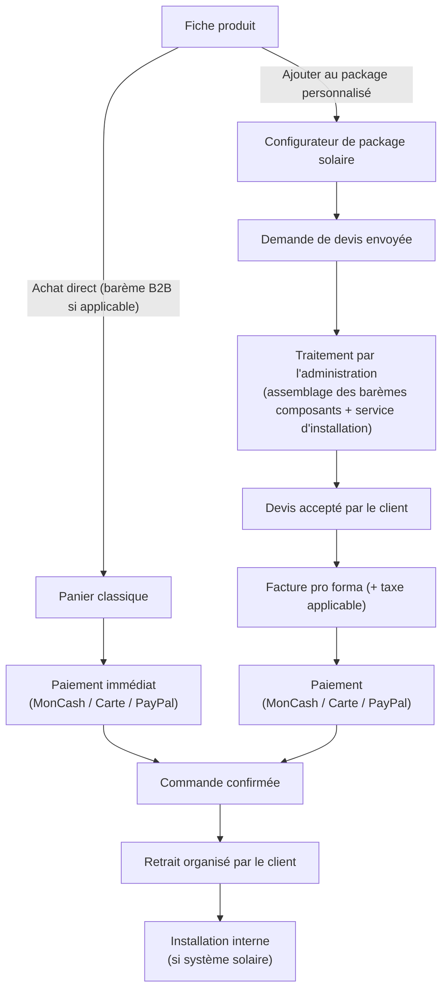
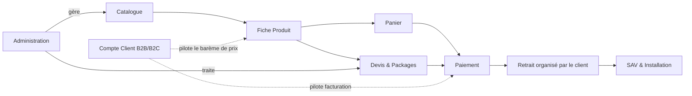
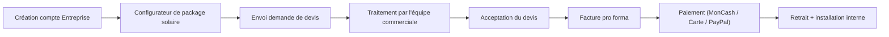

# CAHIER DE VISION DU PROJET

## Plateforme E-commerce B2B/B2C — Électronique & Énergie Solaire (Haïti & Diaspora)

---

### Page de garde

| | |
|---|---|
| **Projet** | Plateforme e-commerce Électronique, Énergie Solaire, Sécurité & Climatisation |
| **Client** | ATC |
| **Type de document** | Cahier de Vision du Projet (Document 1/15) |
| **Version** | 1.2 |
| **Date** | 01/08/2026 |
| **Statut** | Version finale — validée, mise à jour majeure suite au recadrage client (tarification B2B, retrait du module Livraison, retrait de la fidélisation, politique de devise) |
| **Rédigé par** | Architecte Produit Senior (assistance IA) |
| **Diffusion** | Direction, Produit, UX/UI, Développement, QA, DevOps |
| **Confidentialité** | Document interne — usage projet uniquement |

---

### Historique des versions

| Version | Date | Auteur | Description |
|---|---|---|---|
| 0.1 | 01/08/2026 | Architecte Produit (IA) | Rédaction initiale à partir de la synthèse validée |
| 1.0 | 01/08/2026 | Architecte Produit (IA) | Version finale après auto-évaluation et intégration des améliorations |
| 1.1 | 01/08/2026 | Architecte Produit (IA) | Mise à jour suite aux réponses client : nom commercial (ATC), logistique internationale, volumétrie cible |
| 1.2 | 01/08/2026 | Architecte Produit (IA) | Recadrage majeur : nom légal complet (Alpha Tech Center), barème de prix B2B par palier (remplace la négociation), suppression du module Livraison, suppression de la fidélisation, affichage USD uniquement |

---

### Sommaire

1. Introduction et portée du document
2. Contexte marché
3. Vision produit
4. Objectifs stratégiques
5. Objectifs utilisateurs et personas
6. Proposition de valeur et différenciateurs
7. Périmètre du projet (V1)
8. Modèle de vente : deux parcours, un seul écosystème
9. Panorama des modules fonctionnels
10. Parcours utilisateurs macro
11. Contraintes du projet
12. Facteurs clés de succès et KPI de vision
13. Roadmap macro
14. Recommandations
15. Risques
16. Hypothèses
17. Décisions actées
18. Questions restantes
19. Traçabilité et documents liés
20. Conclusion

<!-- pagebreak -->

## 1. Introduction et portée du document

Ce Cahier de Vision constitue le **document fondateur** du projet. Il fixe le cap stratégique, business et produit avant toute entrée dans le détail fonctionnel, technique ou UX, qui sera traité dans les 14 cahiers suivants (PRD, Besoins Fonctionnels, Règles Métiers, Cas d'Utilisation, Spécifications Détaillées, UX/UI, Architecture, Données, Intégrations, Exigences Non Fonctionnelles, Tests, Guides Administrateur/Utilisateur, Dossier Final).

Il s'adresse à l'ensemble des parties prenantes du projet : Direction (validation stratégique), équipe Produit (cadrage du périmètre), UX/UI (compréhension des personas et parcours), Développement/QA/DevOps (compréhension des enjeux techniques amont), afin que chacun partage une même compréhension du projet avant la phase de spécification.

Ce document s'appuie sur l'analyse exhaustive du document *« Liste des fonctionnalités — Site e-commerce Électronique & Énergie Solaire »* fourni par l'entreprise, ainsi que sur les décisions de cadrage validées lors des échanges préparatoires.

## 2. Contexte marché

Le marché haïtien de l'électronique et de l'énergie solaire présente des caractéristiques structurantes pour le projet :

- Une **instabilité du réseau électrique national**, qui fait de l'énergie solaire un besoin quasi essentiel plutôt qu'un produit de confort — ce qui justifie un traitement différencié (configurateur, devis, installation) par rapport à un produit électronique standard.
- Une **connectivité internet hétérogène**, avec des connexions mobiles souvent limitées en bande passante, imposant une exigence forte de performance et de sobriété technique du site.
- Une **diaspora nombreuse et économiquement active**, qui achète fréquemment des équipements pour de la famille restée au pays ou pour ses propres besoins de retour — d'où l'exigence multilingue (FR/EN/ES). Les prix sont affichés exclusivement en USD sur l'ensemble de la plateforme, avec conversion automatique en HTG uniquement au moment du paiement via MonCash (décision actée n°25).
- Un **usage massif du paiement mobile local** (MonCash) conjugué à des moyens de paiement internationaux (cartes, PayPal), qui impose une architecture de paiement hybride ; le virement bancaire n'est volontairement pas proposé, tous les paiements devant transiter par les solutions intégrées à la plateforme (décision actée n°23).
- Une clientèle B2B (hôtels, entreprises, ONG, institutions) pour qui la fiabilité, la facturation conforme et l'accompagnement technique priment sur l'expérience d'achat impulsif propre au B2C. La tarification B2B repose sur des **barèmes de prix par palier de quantité**, directement visibles sur chaque fiche produit, à la manière des places de marché B2B internationales (décision actée n°16).
- Aucun service de livraison n'est proposé par la plateforme : le client organise lui-même le retrait ou le transport de sa commande selon des modalités définies par ATC (décision actée n°27).

## 3. Vision produit

> **Devenir la plateforme e-commerce de référence en Haïti — et pour sa diaspora — pour l'équipement électronique, l'énergie solaire, la sécurité et le confort thermique, en conjuguant la simplicité d'un achat en ligne immédiat pour les particuliers et la rigueur d'un accompagnement sur-mesure pour les professionnels, le tout porté par une expérience premium et fiable, quel que soit le pays ou la qualité de connexion de l'utilisateur.**

Cette vision repose sur trois piliers :

1. **Un seul acteur, deux modèles de vente** : achat direct simple pour l'électronique/sécurité/climatisation, et devis sur-mesure pour les systèmes solaires complexes.
2. **Une confiance construite dès la première visite** : réassurance, avis clients, garanties, facturation professionnelle, support humain accessible.
3. **Une plateforme pensée pour grandir** : architecture scalable dès le lancement, sans dette technique liée à un MVP a minima.

## 4. Objectifs stratégiques

| Réf. | Objectif business | Indicateur associé |
|---|---|---|
| OB1 | Devenir la référence du système solaire complet (vente + installation) en Haïti | Volume de devis traités / mois, taux de conversion devis → commande |
| OB2 | Capter durablement le marché de la diaspora et de la clientèle internationale | % de commandes internationales, répartition des paiements par devise |
| OB3 | Professionnaliser la relation B2B (facturation, barème de prix par volume, comptes dédiés) | Nombre de comptes Entreprise actifs, panier moyen B2B |
| OB4 | Réduire la friction d'achat pour du matériel technique à distance | Taux d'abandon panier, note moyenne des avis produits |
| OB5 | Construire dès le lancement une plateforme scalable, sans refonte majeure à moyen terme | Capacité de montée en charge validée en Architecture (Cahier 8) |

*Note : ces objectifs seront déclinés en exigences mesurables dans le PRD (Cahier 2).*

## 5. Objectifs utilisateurs et personas

| Persona | Profil | Besoins clés | Fréquence d'usage attendue |
|---|---|---|---|
| **Particulier Haïti** | Achète électronique, climatisation, petit solaire | Rapidité, paiement MonCash, retrait simple, confiance | Ponctuelle à récurrente |
| **Particulier diaspora** | Achète pour la famille en Haïti ou pour projet personnel | Paiement carte/PayPal, clarté sur les modalités de retrait, confiance à distance | Ponctuelle, saisonnière |
| **Entreprise (B2B)** | Hôtels, ONG, institutions, entreprises locales | Barème de prix par volume, devis sur-mesure, facture pro forma, fiabilité, suivi historique | Récurrente, projets ponctuels de grande ampleur |
| **Administrateur / équipe interne** | Équipe commerciale, technique, SAV | Back-office centralisé, traitement rapide des devis, visibilité stock/commandes | Quotidienne |

*Ces personas seront enrichis (objectifs détaillés, scénarios, points de friction) dans le Cahier UX/UI (Cahier 7).*

## 6. Proposition de valeur et différenciateurs

- **Le seul acteur du marché à couvrir, sur une même plateforme, l'électronique grand public ET l'énergie solaire complète, installation comprise** — évitant au client de multiplier les fournisseurs.
- **Un configurateur de package solaire personnalisé**, transformant une intention d'achat complexe en demande de devis structurée, sans nécessiter d'expertise technique préalable du client.
- **Une assistance à l'installation 100 % interne** (décision actée) : maîtrise totale de la qualité de service, argument de réassurance fort face à des offres concurrentes sous-traitées.
- **Une expérience conçue pour deux réalités à la fois** : la contrainte de connectivité locale et les standards d'achat internationaux (langue, moyens de paiement).
- **Un barème de prix B2B transparent par palier de quantité**, directement consultable et sélectionnable sur la fiche produit (inspiré des places de marché B2B internationales type Alibaba), sans négociation manuelle pour les achats standards — un positionnement rare sur ce marché.

## 7. Périmètre du projet (V1)

### Inclus en V1

Navigation par catégories, sélecteur de langue (FR/EN/ES), catalogue avec filtres techniques et par marque, recherche avec suggestions, fiches produits complètes avec **barème de prix B2B par palier de quantité** pour les comptes Entreprise validés, catalogue de packages pré-configurés, générateur de package personnalisé avec envoi automatique en devis, suivi de statut du devis, panier classique, paiement MonCash/Visa-Mastercard/PayPal (prix affichés en USD, conversion automatique en HTG uniquement au paiement MonCash), facture pro forma avec taxe locale applicable, comptes Particulier et Entreprise (avec processus de validation B2B en 4 étapes — inscription, documents, vérification, activation), garanties par catégorie, chatbot/WhatsApp, ticket SAV, avis clients, FAQ générale et par catégorie, blog, mentions légales et politique de confidentialité multi-juridictions, back-office complet incluant l'onglet **Contenu** (requalifié Essentielle), sécurité (SSL, protection des données), performance sur connexions faibles, responsive mobile-first, multilingue FR/EN/ES. Le retrait de commande est organisé directement par le client selon des modalités définies par ATC — **aucun service de livraison n'est proposé par la plateforme** (décision actée n°27).

### Explicitement hors périmètre V1 (candidats aux versions ultérieures)

- Historique de devis avancé avec analytics poussée.
- **Tout service de livraison ou de logistique** (transport, suivi de colis, zones et frais de livraison) — retiré du périmètre du projet, décision confirmée par ATC (décision actée n°27), et non un simple report à une version ultérieure.
- **Tout mécanisme de fidélisation** (statuts, points, récompenses, remises liées à la fidélité, niveaux de membres) — retiré intégralement du périmètre, décision confirmée par ATC (décision actée n°26).
- **Le paiement par virement bancaire** — exclu du périmètre quel que soit le montant de la commande (décision actée n°23).
- Fonctionnalités de support client centralisé avancées au-delà du strict nécessaire à l'onglet Contenu/Support (ex. base de connaissance interne enrichie, IA de suggestion de réponses).

*Ce périmètre sera détaillé et rendu exhaustif dans le PRD (Cahier 2) et le Cahier des Besoins Fonctionnels (Cahier 3).*

<!-- pagebreak -->

## 8. Modèle de vente : deux parcours, un seul écosystème

Le projet repose sur la coexistence de deux logiques de vente distinctes mais interconnectées, articulées autour de la fiche produit :

Ce double parcours doit rester **lisible pour l'utilisateur** dès la fiche produit : un point de vigilance UX majeur à traiter prioritairement dans le Cahier UX/UI, afin d'éviter toute confusion entre « ajouter au panier » et « ajouter au package personnalisé ».

## 9. Panorama des modules fonctionnels

| Module | Rôle | Priorité V1 |
|---|---|---|
| Navigation & Catalogue | Structuration de l'offre, filtrage, fiches produits | Essentielle |
| Recherche & Filtres | Accès rapide au bon produit, y compris techniques | Essentielle |
| Devis & Packages | Cœur différenciant : vente directe (barème B2B) + sur-mesure | Essentielle |
| Panier & Commande | Achat direct classique, prix par palier de quantité | Essentielle |
| Paiement & Facturation | MonCash, Visa/Mastercard, PayPal, facture pro forma (USD, conversion HTG au paiement MonCash) | Essentielle |
| ~~Livraison & Logistique~~ | **Annulé** — aucun service de livraison proposé ; retrait organisé par le client (décision actée n°27) | Hors périmètre |
| Compte Client | Distinction B2B/B2C avec validation en 4 étapes, historique commandes/devis | Essentielle |
| SAV & Assistance | Garantie, ticket SAV, installation interne | Essentielle / Recommandée |
| Marketing (Avis clients) | ~~Statuts de fidélité~~ **annulés** (décision actée n°26) ; avis clients conservés | Recommandée |
| Contenu | FAQ, blog, mentions légales | Essentielle (requalifiée) |
| Administration / Back-office | Pilotage global de la plateforme, 2 rôles administrateurs | Essentielle |
| Sécurité & Conformité | SSL, protection des données multi-juridictions | Essentielle |
| Internationalisation | Langues (FR/EN/ES) ; affichage USD uniquement | Essentielle |
| Analytics & Pilotage | Suivi ventes, devis, comportement client | Recommandée |

## 10. Parcours utilisateurs macro

**Parcours — Particulier en Haïti (achat direct)**

**Parcours — Entreprise (devis solaire B2B)**

*Ces parcours seront détaillés écran par écran (objectif, composants, états, micro-interactions) dans le Cahier UX/UI (Cahier 7).*

## 11. Contraintes du projet

- **Techniques** : performance requise sur connexions faibles ; architecture scalable dès le lancement (décision actée) sans sur-dimensionnement inutile des coûts d'infrastructure.
- **Légales** : politique de confidentialité couvrant plusieurs juridictions (Haïti, USA, Canada, UE le cas échéant), CGV adaptées à l'export.
- **Opérationnelles** : l'installation solaire étant interne, la capacité de l'équipe technique conditionne le volume de devis pouvant être honorés — point de vigilance business à surveiller au-delà du strict cadre du site.
- **Linguistiques et monétaires** : maintenance continue de contenus en trois langues (FR/EN/ES) ; affichage des prix exclusivement en USD, avec conversion automatique en HTG uniquement au moment du paiement MonCash, selon un taux interne défini par l'administrateur (décision actée n°25).
- **Logistique** : aucun service de livraison n'étant proposé, la communication des modalités de retrait doit être claire et visible à chaque étape du parcours d'achat, pour éviter toute confusion ou déception client (décision actée n°27).
- **Absence de contrainte budgétaire identifiée** (décision actée) : ne dispense pas d'arbitrages de priorisation raisonnés, mais laisse une liberté de choix technique et UX plus large que sur un projet à budget contraint.

## 12. Facteurs clés de succès et KPI de vision

| Facteur clé de succès | KPI de vision associé |
|---|---|
| Clarté du double parcours achat direct / devis | Taux de rebond sur fiche produit, taux d'usage du configurateur |
| Rapidité de traitement des devis | Délai moyen de première réponse à un devis |
| Confiance de la clientèle internationale | % d'avis clients positifs, taux de conversion diaspora |
| Fidélisation B2B (sans programme dédié) | Taux de réachat des comptes Entreprise |
| Robustesse technique | Temps de chargement moyen, disponibilité de la plateforme |

*Les KPI détaillés et consolidés seront repris et complétés dans le Dossier Final de Validation (Cahier 15).*

## 13. Roadmap macro

| Horizon | Contenu indicatif |
|---|---|
| **Court terme — V1 (lancement)** | Ensemble du périmètre V1 défini en section 7 : catalogue, devis/packages, barème de prix B2B, paiement, comptes, back-office complet, sécurité, multilingue |
| **Moyen terme — V1.x (6 à 12 mois post-lancement)** | Enrichissement analytics, historique de devis avancé, optimisation SEO multilingue, extension des paliers de prix B2B |
| **Long terme — V2 (12 à 24 mois)** | Extension du catalogue à de nouvelles familles de produits ; un éventuel service de livraison n'est pas planifié à ce stade et devra faire l'objet d'une nouvelle décision stratégique si la stratégie d'ATC évolue |

*Cette roadmap est indicative à ce stade ; elle sera affinée et priorisée dans le Dossier Final de Validation (Cahier 15).*

## 14. Recommandations

1. **Communiquer clairement les modalités de retrait** (aucune livraison proposée) dès la fiche produit et la confirmation de commande, pour éviter toute confusion côté client, en particulier la clientèle diaspora habituée à un service de livraison porte-à-porte.
2. **Transmettre les fichiers de marque officiels d'ATC (Alpha Tech Center)** — logo et charte graphique existants — à l'équipe UX/UI dès le démarrage du Cahier 7.
3. **Dimensionner l'architecture sur la base d'environ 50 transactions/jour** (décision actée n°12), avec une marge de croissance raisonnable, afin d'éviter une sur-ingénierie coûteuse malgré l'absence de contrainte budgétaire.
4. **Anticiper la capacité opérationnelle de l'équipe d'installation interne** face au volume de devis solaires attendu, afin que la promesse de service reste tenable.
5. **Transmettre, quand elles seront disponibles, les durées de garantie réelles par catégorie** : des valeurs de travail (12 à 24 mois selon catégorie) sont validées entre-temps. Le taux de taxe (10 %) est désormais confirmé.

## 15. Risques

| Risque | Impact | Niveau |
|---|---|---|
| Confusion UX entre achat direct et devis sur-mesure | Abandon, insatisfaction client | Élevé |
| Absence de tout service de livraison, alors que la clientèle diaspora est habituée à un service porte-à-porte | Risque commercial d'attractivité réduite pour la clientèle internationale | Moyen |
| Sur-ingénierie technique liée à « scalable dès le départ » mal cadré | Surcoût de temps, complexité inutile | Moyen |
| Dépendance à MonCash pour le marché local | Risque de disponibilité/évolution du service tiers | Moyen |
| Capacité limitée de l'équipe d'installation interne face à la demande | Délais clients, insatisfaction B2B | Moyen |
| Conformité légale multi-juridictions mal cadrée | Risque juridique, perte de confiance internationale | Moyen |
| Écart entre le taux de change interne et le taux réel du marché | Perception de prix gonflés par la clientèle locale payant en HTG via MonCash | Moyen |
| Suppression du programme de fidélité par rapport à la stratégie initiale | Rétention des clients B2B réguliers reposant uniquement sur la qualité de service | Faible à moyen |

## 16. Hypothèses

- « Mon Cash » désigne le service MonCash de Digicel Haïti.
- Il n'existe qu'un seul vendeur sur la plateforme (pas de logique de marketplace multi-vendeurs).
- Le traitement du devis de package solaire reste manuel pour l'assemblage final (composants + installation), assuré par l'équipe commerciale interne ; les prix des composants individuels suivent désormais les barèmes par palier (décision actée n°16).
- Les « 50 transactions/jour » communiquées par le client (décision actée n°12) sont interprétées comme un volume cible de commandes et devis confondus ; à confirmer si l'unité visée diffère (ex. nombre de visiteurs).

## 17. Décisions actées

| # | Sujet | Décision | Impact principal |
|---|---|---|---|
| 1 | Transporteurs/logistique internationale | ~~Information non disponible~~ → **rendu sans objet par la décision n°27** (aucune livraison proposée) | — |
| 2 | Cadre légal / données personnelles | Politique de confidentialité multi-juridictions (Haïti, USA, Canada, UE le cas échéant) | Cahier des Exigences Non Fonctionnelles, Informations légales |
| 3 | Tarifs préférentiels B2B | ~~Négociation au cas par cas~~ → **remplacé par la décision n°16** (barème de prix par palier de quantité) | Module Devis, Fiche Produit |
| 4 | Programme de fidélité | ~~Statuts Bronze / Argent / Or~~ → **annulé par la décision n°26** | — |
| 5 | Assistance à l'installation solaire | Réalisée en interne | Module SAV, capacité opérationnelle |
| 6 | Ambition technique | Plateforme scalable dès le départ | Cahier d'Architecture, Exigences Non Fonctionnelles |
| 7 | Contrainte budgétaire | Aucune contrainte identifiée | Liberté d'arbitrage technique/UX |
| 8 | Rôles multi-utilisateurs compte Entreprise | Non nécessaire | Compte Entreprise simple, sans distinction acheteur/approbateur |
| 9 | Onglet Admin « Contenu » | Requalifié Essentielle (au lieu d'Optionnelle) | Back-office, cohérence avec FAQ/légal essentiels côté front |
| 10 | Nom commercial de l'entreprise | ATC | Page de garde et identité de marque de l'ensemble des cahiers |
| 11 | Partenaires logistiques / transporteurs internationaux | ~~Aucun partenaire identifié~~ → **rendu sans objet par la décision n°27** | — |
| 12 | Volumétrie cible pour le dimensionnement de la scalabilité | Environ 50 transactions (commandes/devis) par jour visées | Cahier d'Architecture Logicielle, Exigences Non Fonctionnelles |
| 13 | Seuils des statuts de fidélité | ~~Bronze/Argent/Or~~ → **annulé par la décision n°26** | — |
| 14 | Ordre de mise en œuvre des Epics | Confirmé par le client (voir PRD, section 14) | Planification développement |
| 15 | Nom légal complet de l'entreprise | ATC signifie « Alpha Tech Center » | Mentions légales, factures, page de garde |
| 16 | Tarification B2B | Barème de prix par palier de quantité par produit, affiché et sélectionnable sur la fiche produit pour les comptes Entreprise validés (modèle inspiré d'Alibaba) ; remplace la négociation au cas par cas pour les achats standards | Fiche Produit, Panier, Back-office Catalogue |
| 17 | Processus de validation des comptes Entreprise | Processus détaillé en 4 étapes : inscription (informations légales), documents (patente, NIF, registre, pièce d'identité), vérification par l'administrateur, activation | Compte Client, Back-office Clients (détail en Cahier 4) |
| 18 | Taxe/TVA sur factures | Taux confirmé à **10 %**, doit apparaître sur les factures pro forma et définitives | Module Paiement & Facturation |
| 19 | Durées de garantie par catégorie | Valeurs de travail validées par ATC « pour l'instant » (12/24 mois selon catégorie), durées définitives à transmettre ultérieurement | Module SAV |
| 20 | Rôles administrateurs | Deux rôles uniquement : Général et Agent SAV, aucun rôle supplémentaire | Back-office, permissions |
| 21 | Seuils d'alerte de stock | Basés sur un pourcentage du stock de référence : alerte orange ≤ 40 %, alerte rouge ≤ 15 % | Fiche Produit, Tableau de bord admin |
| 22 | Délai d'expiration d'un devis | 3 jours après réponse de l'équipe commerciale | Module Devis |
| 23 | Paiement par virement bancaire | Exclu du périmètre, quel que soit le montant de la commande | Module Paiement |
| 24 | Gestion du taux de change HTG/USD | Défini et mis à jour manuellement par l'administrateur, indépendant de toute source externe (BRH ou autre), reflétant la politique commerciale interne d'ATC | Module Paiement, Paramètres généraux |
| 25 | Affichage des prix | Exclusivement en USD sur toute la plateforme ; conversion automatique en HTG uniquement lors du paiement par MonCash, selon le taux interne (décision n°24) | Toute la plateforme, Paiement |
| 26 | Programme de fidélisation | Annulé intégralement (statuts, points, récompenses, remises, niveaux) — retiré du périmètre du projet | Module Marketing |
| 27 | Service de livraison | Annulé intégralement — aucune livraison proposée ; retrait/transport à la charge du client selon des modalités définies par ATC | Module Livraison (supprimé), Commande |
| 28 | Valeur par défaut du stock de référence | 100 unités (valeur fictive de travail), remplaçable sans impact structurel | Module Catalogue |
| 29 | Règle minimale du configurateur de package | Au moins un panneau solaire et une batterie requis pour valider une demande de devis | Module Devis & Packages |
| 30 | Formats et taille des documents Entreprise | PDF, JPG, PNG acceptés — taille maximale 5 Mo par fichier | Module Compte Client |
| 31 | Palette et typographie du design system | Validées comme base de travail (bleu pétrole `#0E2A3D` / ambre solaire `#F5A623`, polices Sora/Inter), en attendant les fichiers de marque définitifs d'ATC | Cahier UX/UI |
| 32 | Cas limite d'expiration du devis (J+3 exact) | L'acceptation exactement à l'instant J+3 est considérée comme encore valide | Module Devis & Packages |
| 33 | Arrondi de la taxe sur les factures | Arrondi au centime le plus proche (méthode arithmétique standard) | Module Paiement & Facturation |
| 34 | Choix du prestataire de paiement carte (PSP) | Laissé libre à l'équipe technique, aucune préférence exprimée par ATC | Cahier des Intégrations |
| 35 | Équipe de développement | Projet confié à un prestataire déjà identifié par ATC | Pilotage projet |
| 36 | Conservation des documents Entreprise | Durée indéfinie, aucune suppression automatique programmée | Module Compte Client |
| 37 | Politique de suppression des comptes inactifs | Aucune : les comptes sont conservés indéfiniment, quelle que soit leur inactivité | Module Compte Client |
| 38 | Intégration WhatsApp | Intégration directe avec la plateforme Meta (pas de fournisseur tiers/BSP) | Cahier des Intégrations |
| 39 | Palette de couleurs officielle | Bleu ATC `#014DAB`, bleu électrique `#018DDE`, accent orange-rouge `#FE4028` — mesurés sur le logo officiel reçu | Cahier UX/UI |
| 40 | Visuels marketing fournisseur (Sécurité) | Utilisés tels quels sur le site, texte anglais incrusté conservé | Module Catalogue |
| 41 | Comptes techniques tiers non encore disponibles | Développement mené en environnement sandbox/test (MonCash, PSP, WhatsApp) ; fonctionnement démontré à ATC lors d'une démo avant bascule en production | Cahier des Intégrations |
| 42 | Catalogue produit réel | Données fictives de démonstration utilisées en attendant les informations réelles d'ATC, remplaçables sans impact structurel | Module Catalogue |
| 43 | Typographie officielle | Confirmée : Sora (titres) / Inter (texte courant) — ATC délègue le choix à l'équipe projet | Cahier UX/UI |
| 44 | Charte graphique écrite | N'existe pas ; seuls les fichiers logo font foi pour l'identité visuelle | Cahier UX/UI |
| 45 | Nom de domaine et hébergement | Non déterminés par ATC ; laissés au prestataire de développement | Cahier d'Architecture |

## 18. Questions restantes

1. ~~Transporteurs/partenaires logistiques~~ — **Sans objet** : aucun service de livraison n'est proposé par la plateforme (décision actée n°27).
2. ~~Nom commercial et identité de marque~~ — **Résolu** : nom commercial ATC, signifiant « Alpha Tech Center » (décision actée n°15) ; logo et charte graphique existants, transmission confirmée par ATC.
3. ~~Cadrage chiffré de la scalabilité~~ — **Résolu** : volumétrie cible d'environ 50 transactions/jour (décision actée n°12).
4. ~~Valeur par défaut du stock de référence~~ — **Résolu** : 100 unités (décision actée n°28).

**Toutes les questions stratégiques du Cahier de Vision sont désormais résolues.** Des questions plus opérationnelles ont émergé dans les cahiers suivants (Architecture, Données) — voir le registre consolidé tenu à jour au fil du projet.

## 19. Traçabilité et documents liés

Ce Cahier de Vision est le document racine du projet. Toutes les décisions actées en section 17 seront reprises **sans modification** dans les cahiers suivants, notamment :

- Le **PRD (Cahier 2)** déclinera les objectifs stratégiques (section 4) en exigences produit mesurables.
- Le **Cahier des Besoins Fonctionnels (Cahier 3)** et le **Cahier des Règles Métiers (Cahier 4)** détailleront le périmètre V1 (section 7) et le modèle de vente (section 8).
- Le **Cahier UX/UI (Cahier 7)** approfondira les personas (section 5) et les parcours macro (section 10).
- Le **Cahier d'Architecture Logicielle (Cahier 8)** traduira l'ambition de scalabilité (décision n°6) en choix techniques concrets.
- Le **Dossier Final de Validation (Cahier 15)** consolidera la roadmap (section 13) et les KPI (section 12).

## 20. Conclusion

Ce Cahier de Vision pose les fondations stratégiques d'un projet ambitieux : une plateforme e-commerce premium, capable de servir aussi bien l'achat impulsif d'un particulier en Haïti que l'acquisition d'un système solaire complet pour une entreprise internationale. Sa réussite reposera sur la capacité à garder ce double modèle **lisible et fluide** pour l'utilisateur, tout en construisant, dès le lancement, une plateforme technique à la hauteur de l'ambition de scalabilité affichée.

Suite aux réponses détaillées d'ATC, le projet a connu un recadrage important : la négociation B2B au cas par cas est remplacée par un **barème de prix transparent par palier de quantité** (décision n°16), le **programme de fidélité est annulé** (décision n°26), **aucun service de livraison n'est proposé** — le client gère lui-même le retrait de sa commande (décision n°27), et les prix sont **affichés exclusivement en USD**, avec conversion en HTG uniquement au paiement MonCash (décision n°25). Le nom légal complet d'ATC — Alpha Tech Center — est également confirmé, de même que l'existence d'une identité visuelle prête à être transmise à l'équipe UX/UI.

---

*Fin du Cahier de Vision du Projet — Document 1/15*
