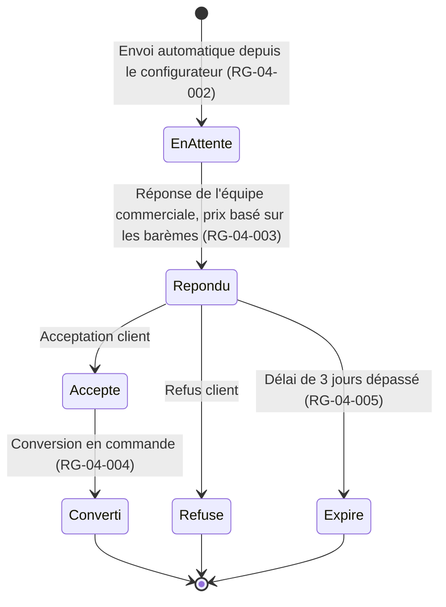
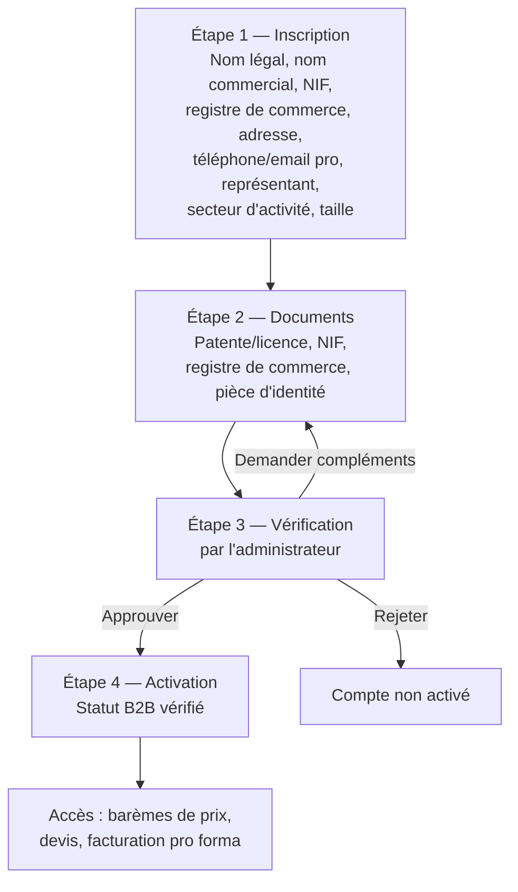

# CAHIER DES RÈGLES MÉTIERS

## Plateforme E-commerce B2B/B2C — Électronique & Énergie Solaire (ATC — Haïti & Diaspora)

---

### Page de garde

| | |
|---|---|
| **Projet** | Plateforme e-commerce Électronique, Énergie Solaire, Sécurité & Climatisation |
| **Client** | ATC |
| **Type de document** | Cahier des Règles Métiers (Document 4/15) |
| **Version** | 1.4 |
| **Date** | 01/08/2026 |
| **Statut** | Version finale — validée, plus aucun point bloquant |
| **Documents parents** | Cahier de Vision (Doc. 1/15), PRD (Doc. 2/15), Cahier des Besoins Fonctionnels (Doc. 3/15) |
| **Diffusion** | Direction, Produit, UX/UI, Développement, QA, DevOps |
| **Confidentialité** | Document interne — usage projet uniquement |

---

### Historique des versions

| Version | Date | Auteur | Description |
|---|---|---|---|
| 0.1 | 01/08/2026 | Architecte Produit (IA) | Rédaction initiale des règles métier par domaine |
| 1.0 | 01/08/2026 | Architecte Produit (IA) | Version finale après auto-évaluation et intégration des améliorations |
| 1.1 | 01/08/2026 | Architecte Produit (IA) | Recadrage majeur : barème B2B par palier, validation Entreprise en 4 étapes, suppression RG-07 (Livraison) et RG-10 (Fidélité), stock en pourcentage, devise USD unique — 9 hypothèses sur 12 désormais résolues |
| 1.2 | 01/08/2026 | Architecte Produit (IA) | Taux de taxe confirmé à 10 % (RG-06-002) ; durées de garantie validées comme valeurs de travail (RG-09-001) — 1 hypothèse restante sur 12 |
| 1.3 | 01/08/2026 | Architecte Produit (IA) | Stock de référence : valeur de travail fixée à 100 unités (décision actée n°28) — 0 hypothèse restante sur 12 |
| 1.4 | 01/08/2026 | Architecte Produit (IA) | Confirmation de H1-H5 (RG-04-005, RG-04-006 nouvelle, RG-06-002) et résolution de Q3-Q7 (décisions n°29 à 38) — projet entièrement clarifié hors réception des fichiers de marque |

---

### Sommaire

1. Introduction
2. Méthodologie et légende
3. Règles métier par domaine (RG-03 à RG-14)
4. Registre des hypothèses provisoires à confirmer par ATC
5. Risques
6. Hypothèses
7. Décisions actées
8. Questions restantes
9. Traçabilité et documents liés
10. Conclusion

<!-- pagebreak -->

## 1. Introduction

Ce cahier formalise la **logique métier précise** — calculs, seuils, conditions, cycles de vie — derrière les besoins fonctionnels du Cahier 3 qui l'exigent. Les besoins purement d'affichage ou de navigation, sans logique de calcul ou de décision, ne font pas l'objet d'une règle dédiée ici.

Suite aux réponses détaillées d'ATC, l'ensemble des hypothèses initiales sont désormais résolues (tarification B2B, processus de validation Entreprise, gestion de la devise, alertes de stock avec valeur de référence par défaut, délai d'expiration des devis, rôles administrateurs, taxe à 10 %, durées de garantie validées comme valeurs de travail). Ce cahier ne comporte plus de zone d'incertitude bloquante.

## 2. Méthodologie et légende

**Convention d'identifiant :** `RG-[N° Epic]-[N° séquentiel]`, ex. `RG-04-003` = 3ᵉ règle de gestion de l'EPIC-04 (Devis & Packages).

**Statut d'une règle :**
- **Confirmée** : basée sur une décision actée par ATC.
- **Hypothèse provisoire** : proposée en l'absence d'information, à valider avant développement.

Chaque règle référence le ou les besoins fonctionnels (`BF-XX-NNN`) du Cahier 3 auxquels elle s'applique.

<!-- pagebreak -->

## 3. Règles métier par domaine

### RG-03 — Catalogue & Fiche Produit

**RG-03-001 — Détermination du prix affiché** *(Confirmée — principe ; barème à définir en Cahier des Données)*
SI le client est connecté ET son compte est de type Entreprise ET son compte est validé (RG-08-001) → afficher le prix B2B.
SINON → afficher le prix B2C (prix public).
*Référence : BF-03-005.*

**RG-03-002 — Statut de stock affiché** *(Confirmée — décision actée n°21)*
Le seuil est calculé en pourcentage du stock de référence défini par l'administrateur pour chaque produit : `pourcentage = (stock actuel / stock de référence) × 100`.
SI stock actuel = 0 → statut « Rupture de stock » (achat direct désactivé ; ajout au package personnalisé sur devis reste possible).
SI pourcentage ≤ 15 % → **alerte rouge** (réapprovisionnement immédiat nécessaire).
SI 15 % < pourcentage ≤ 40 % → **alerte orange** (réapprovisionnement recommandé).
SINON (> 40 %) → statut « En stock » (pas d'alerte).
Les alertes orange et rouge sont visibles dans le tableau de bord (BF-12-001) et dans la fiche de gestion du produit (BF-12-002).
*Référence : BF-03-002, BF-12-001, BF-12-002.*
**Valeur de travail (décision actée n°28) :** en l'absence de valeur réelle par produit, le stock de référence est initialisé à **100 unités** par défaut à la création d'un produit (valeur fictive, modifiable individuellement par l'administrateur). Le champ est conçu dès l'origine comme éditable produit par produit, afin que le remplacement par les valeurs réelles d'ATC ne nécessite aucune modification structurelle du système.

**RG-03-003 — Association produit / accessoire compatible** *(Confirmée — principe)*
Les liens entre un produit et ses accessoires compatibles sont saisis manuellement par l'administrateur (pas de règle de compatibilité technique automatique en V1).
*Référence : BF-03-006, BF-12-002.*

**RG-03-004 — Barème de prix B2B par palier de quantité** *(Confirmée — décision actée n°16)*
Chaque produit éligible à la vente B2B peut disposer de plusieurs paliers de prix, définis par l'administrateur sous la forme `[quantité min – quantité max] → prix unitaire` (BF-12-002). Sur la fiche produit, un client Entreprise au statut « B2B vérifié » (RG-08-001) visualise l'ensemble des paliers disponibles, sélectionne la quantité désirée, et le prix unitaire applicable s'affiche immédiatement (BF-03-007). Ce prix est répercuté automatiquement dans le panier lors de l'ajout (BF-05-003). Ce mécanisme remplace la négociation manuelle pour les achats standards ; seuls les packages solaires personnalisés (assemblage de plusieurs produits + installation) continuent de passer par le circuit de devis (RG-04).
*Référence : BF-03-007, BF-05-003, décision actée n°16.*

### RG-04 — Devis & Packages personnalisés

**Cycle de vie d'un devis :**

**RG-04-001 — États possibles d'un devis** *(Confirmée — principe)*
Un devis suit strictement les états suivants : *En attente → Répondu → (Accepté → Converti) / Refusé / Expiré*. Aucun retour en arrière d'état n'est autorisé (un nouveau devis doit être créé si besoin).
*Référence : BF-04-004.*

**RG-04-002 — Génération automatique de la demande de devis**
Dès validation du configurateur par le client, une demande de devis est créée automatiquement avec : détail de la configuration (produits, quantités), profil client (B2B/B2C), horodatage. Statut initial = « En attente ».
*Référence : BF-04-002, BF-04-003.*

**RG-04-003 — Détermination du prix d'un devis (package personnalisé)** *(Confirmée — décision actée n°16)*
Le prix d'un devis résulte de la somme des prix de chaque composant, déterminés selon leur barème de palier de quantité respectif (RG-03-004), à laquelle s'ajoute, le cas échéant, le coût du service d'installation interne (RG-09-002). L'administrateur assemble le devis à partir de ces éléments ; il ne dispose pas d'un pouvoir de remise discrétionnaire supplémentaire en V1.
*Référence : BF-04-006, décision actée n°16.*

**RG-04-004 — Conversion du devis en commande**
Un devis au statut « Accepté » par le client peut être converti en commande par l'administrateur. La conversion fige le prix (non modifiable a posteriori sans nouvelle validation).
*Référence : BF-04-007.*

**RG-04-005 — Expiration d'un devis** *(Confirmée — décision actée n°22)*
Un devis « Répondu » non accepté par le client dans un délai de **3 jours** passe automatiquement au statut « Expiré ». **Précision du cas limite (décision actée n°32) :** l'acceptation intervenant exactement à l'instant J+3 est considérée comme encore valide ; l'expiration ne s'applique que strictement après ce délai.
*Référence : BF-04-008, décisions actées n°22 et n°32.*

**RG-04-006 — Cohérence minimale du configurateur de package** *(Confirmée — décision actée n°29)*
Une demande de devis via le configurateur personnalisé ne peut être validée et envoyée que si la configuration comprend **au moins un panneau solaire et une batterie**. En deçà, le bouton de validation reste inactif.
*Référence : BF-04-002, décision actée n°29.*

### RG-06 — Paiement & Facturation

**RG-06-001 — Moyens de paiement acceptés** *(Confirmée — décision actée n°23)*
MonCash, carte Visa/Mastercard et PayPal sont les seuls moyens de paiement proposés, quel que soit le montant de la commande. Le virement bancaire n'est pas proposé, sans exception.
*Référence : BF-06-001 à BF-06-003, BF-06-004 (non retenu).*

**RG-06-002 — Génération de la facture pro forma** *(Confirmée — décision actée n°18)*
Générée automatiquement à l'acceptation d'un devis B2B, avant paiement. Numérotation séquentielle unique. Mentions obligatoires : identité d'ATC, identité du client, détail produits/prix, conditions de paiement, devise (USD), **taxe locale de 10 %** appliquée au montant total, **arrondie au centime le plus proche** (méthode arithmétique standard — décision actée n°33).
*Référence : BF-06-005, décisions actées n°18 et n°33.*

**RG-06-003 — Gestion du taux de change HTG/USD** *(Confirmée — décision actée n°24)*
Le taux de change est défini et mis à jour manuellement par l'administrateur dans les Paramètres généraux (BF-12-015). Il reflète la politique commerciale interne d'ATC et est **indépendant de toute source externe** (Banque de la République d'Haïti ou autre) : aucune récupération automatique de taux externe n'est effectuée.
*Référence : BF-06-001, BF-12-015, décision actée n°24.*

**RG-06-004 — Affichage des prix et conversion au paiement** *(Confirmée — décision actée n°25)*
Tous les prix (produits, panier, devis, factures) sont affichés exclusivement en **USD** sur l'ensemble de la plateforme. Une conversion automatique en **HTG** est appliquée uniquement lorsque le client sélectionne **MonCash** comme moyen de paiement, sur la base du taux interne défini en RG-06-003. Aucune autre conversion de devise n'est proposée à l'affichage.
*Référence : BF-06-006, BF-01-005 (non retenu), décision actée n°25.*

### ~~RG-07 — Livraison & Logistique~~ — ANNULÉ (décision actée n°27)

Aucune règle de livraison n'est nécessaire : la plateforme ne propose aucun service de livraison. Voir **RG-05-001** (nouvelle règle, ci-dessous) pour la seule règle conservée relative au retrait de commande.

### RG-05 — Panier & Commande

**RG-05-001 — Statut de commande et retrait** *(Confirmée — décision actée n°27)*
Une commande passe au statut « Prête pour retrait » dès sa préparation par l'équipe ATC ; une notification est envoyée au client avec les modalités de récupération (lieu, horaires). Aucun frais ni processus de livraison n'est géré par la plateforme : le retrait ou le transport est entièrement à la charge du client.
*Référence : BF-05-004, décision actée n°27.*

### RG-08 — Compte Client

**Processus de validation d'un compte Entreprise :**

**RG-08-001 — Validation d'un compte Entreprise** *(Confirmée — décision actée n°17)*
Un compte créé avec le statut « Entreprise » est actif immédiatement pour la navigation, mais l'accès aux tarifs B2B, aux barèmes de prix et à la facturation pro forma nécessite une validation en 4 étapes :
1. **Inscription** : nom légal de l'entreprise, nom commercial (si différent), NIF, numéro de registre de commerce (si disponible), adresse, téléphone professionnel, email professionnel, nom et fonction du représentant, secteur d'activité, taille de l'entreprise (optionnel).
2. **Documents** : téléversement de la patente ou licence commerciale, du NIF, du registre de commerce (si applicable), et d'une pièce d'identité du représentant.
3. **Vérification** : l'administrateur examine les informations saisies, les documents, et la cohérence de l'email professionnel (et du site web le cas échéant). Il peut Approuver, Rejeter, ou Demander des informations complémentaires (retour à l'étape 2).
4. **Activation** : une fois approuvé, le compte passe au statut « B2B vérifié » et accède à l'ensemble des avantages (prix professionnels par palier, devis, conditions de paiement spécifiques).
*Référence : BF-08-001, BF-08-006 à BF-08-009, décision actée n°17.*

**RG-08-002 — Formats et taille des documents Entreprise** *(Confirmée — décision actée n°30)*
Les documents téléversés à l'étape 2 (patente/licence, NIF, registre de commerce, pièce d'identité) doivent être aux formats **PDF, JPG ou PNG**, avec une taille maximale de **5 Mo par fichier**. Tout fichier hors de ces critères est rejeté avec un message explicite.
*Référence : BF-08-007, décision actée n°30.*

**RG-08-003 — Conservation des documents et des comptes inactifs** *(Confirmée — décisions actées n°36 et n°37)*
Les documents Entreprise (patente, NIF, pièce d'identité) sont conservés pour une **durée indéfinie**, sans suppression automatique programmée. Aucune politique de suppression ou d'anonymisation n'est appliquée aux comptes inactifs, quelle que soit leur durée d'inactivité : les comptes et leurs données associées sont conservés indéfiniment, sauf demande explicite de suppression par le client (droit d'accès/suppression, Cahier 11 section 11).
*Référence : Cahier des Données (Cahier 9, section 7), décisions actées n°36 et n°37.*

### RG-09 — SAV & Assistance

**RG-09-001 — Durée de garantie par catégorie** *(Confirmée provisoirement — décision actée n°19, valeurs validées par ATC « pour l'instant »)*
Valeurs de travail validées par ATC, en attendant les durées réelles définitives : Électronique = 12 mois ; Énergie solaire (panneaux, batteries) = 24 mois ; Sécurité (caméras) = 12 mois ; Climatisation = 12 mois.
*Référence : BF-09-001, décision actée n°19.*

**RG-09-002 — Éligibilité à l'assistance à l'installation interne**
Réservée aux produits de la famille Énergie solaire achetés via package pré-configuré ou devis personnalisé ; non applicable à l'électronique, la sécurité ou la climatisation en V1.
*Référence : BF-09-004, décision actée n°5.*

### ~~RG-10 — Marketing & Fidélisation~~ — ANNULÉ (décision actée n°26)

~~Calcul du statut de fidélité~~ — **Règle annulée intégralement.** Aucun mécanisme de fidélisation (statuts, points, récompenses, remises, niveaux de membres) ne sera développé, conformément à la décision actée n°26. La règle RG-10-001 et le diagramme associé, présents dans la version 1.0 de ce cahier, sont retirés du périmètre actif.

**RG-10-002 — Non-cumul avec code promotionnel** *(Confirmée)*
Sans objet : aucun mécanisme de code promotionnel n'existe sur la plateforme.
*Référence : BF-10-004.*

### RG-12 — Administration / Back-office

**RG-12-001 — Permissions par rôle administrateur** *(Confirmée — décision actée n°20)*
Deux rôles fixes en V1, sans rôle supplémentaire : « Administrateur général » (accès complet) et « Agent SAV/Support » (accès aux onglets Devis, Commandes, Clients, Assistance/SAV ; sans accès à la gestion des prix ni aux Paramètres généraux).
*Référence : BF-12-014, décision actée n°20.*

**RG-12-002 — Modération des avis clients**
Un avis est publié uniquement après validation manuelle par un administrateur. Statut par défaut à la soumission : « En attente de modération ».
*Référence : BF-12-012, BF-10-006.*

### RG-14 — Internationalisation

**RG-14-001 — Langue par défaut** *(Confirmée — décision actée n°25)*
Langue par défaut : français, quel que soit le pays du visiteur. Modification manuelle possible à tout moment (BF-01-004). Les prix sont systématiquement affichés en USD, sans variation par pays (RG-06-004) — aucune logique de devise par défaut selon la localisation n'est nécessaire.
*Référence : BF-01-004, BF-01-005 (non retenu), décision actée n°25.*

<!-- pagebreak -->

## 4. Registre des hypothèses provisoires à confirmer par ATC

*Ce registre comptait 12 hypothèses en version 1.0, puis 3 en version 1.1, puis 1 en version 1.2. Suite à la dernière réponse d'ATC (principe de valeurs fictives temporaires validé pour le stock de référence), **plus aucune hypothèse bloquante ne subsiste** :*

| Règle | Sujet | Statut |
|---|---|---|
| RG-03-002 | Valeur par défaut du stock de référence | **Résolu** : 100 unités par défaut (valeur fictive de travail — décision actée n°28), champ conçu pour remplacement facile sans impact structurel |

**Hypothèses résolues depuis la v1.0** (converties en règles confirmées, voir section 3) : seuil de stock (désormais en %, avec valeur par défaut), plafond de négociation B2B (remplacé par le barème), délai d'expiration du devis (3 jours), seuil de virement bancaire (virement exclu), taxe sur facture (10 %, confirmée), source du taux de change (interne, confirmée), processus de validation Entreprise (détaillé en 4 étapes), fenêtre de fidélité (programme annulé), rôles administrateurs (2 rôles fixes), langue/devise par défaut (USD unique), durées de garantie (valeurs de travail validées par ATC), stock de référence (valeur par défaut validée par ATC).

## 5. Risques

| Risque | Impact | Niveau |
|---|---|---|
| Valeur par défaut de 100 unités potentiellement inadaptée à certaines catégories (ex. accessoires vendus en grand volume vs panneaux solaires unitaires) | Alertes de stock peu pertinentes tant que l'administrateur n'ajuste pas produit par produit | Faible |
| Durées de garantie provisoires utilisées comme valeurs de travail, potentiellement différentes des durées définitives à venir | Risque de litige SAV si un client se fie à une durée qui change ultérieurement | Faible à moyen |
| Complexité du barème de prix B2B si le nombre de paliers par produit devient élevé | Risque d'erreur d'affichage ou de calcul du prix applicable | Moyen |

## 6. Hypothèses

Toutes les hypothèses de ce cahier sont désormais résolues (voir registre section 4, qui ne contient plus aucune ligne active). Les hypothèses générales des Cahiers 1 à 3 restent valables et ne sont pas reproduites ici.

## 7. Décisions actées

Reprises à l'identique des cahiers précédents, sans modification :

| # | Sujet | Décision |
|---|---|---|
| 1 | Transporteurs/logistique internationale | ~~Aucun partenaire identifié~~ → **rendu sans objet par la décision n°27** |
| 2 | Cadre légal / données personnelles | Politique de confidentialité multi-juridictions |
| 3 | Tarifs préférentiels B2B | ~~Négociation au cas par cas~~ → **remplacé par la décision n°16** |
| 4 | Programme de fidélité | ~~Statuts Bronze / Argent / Or~~ → **annulé par la décision n°26** |
| 5 | Assistance à l'installation solaire | Réalisée en interne |
| 6 | Ambition technique | Plateforme scalable dès le départ |
| 7 | Contrainte budgétaire | Aucune contrainte identifiée |
| 8 | Rôles multi-utilisateurs compte Entreprise | Non nécessaire |
| 9 | Onglet Admin « Contenu » | Requalifié Essentielle |
| 10 | Nom commercial de l'entreprise | ATC |
| 11 | Partenaires logistiques / transporteurs internationaux | ~~Aucun partenaire identifié~~ → **rendu sans objet par la décision n°27** |
| 12 | Volumétrie cible pour la scalabilité | Environ 50 transactions (commandes/devis) par jour |
| 13 | Seuils des statuts de fidélité | ~~Bronze/Argent/Or~~ → **annulé par la décision n°26** |
| 14 | Ordre de mise en œuvre des Epics | Confirmé par le client (EPIC-07 retiré) |
| 15 | Nom légal complet de l'entreprise | ATC signifie « Alpha Tech Center » |
| 16 | Tarification B2B | Barème de prix par palier de quantité (RG-03-004), remplace la négociation |
| 17 | Validation des comptes Entreprise | Processus en 4 étapes (RG-08-001) |
| 18 | Taxe/TVA sur factures | Taux confirmé à **10 %**, appliqué sur pro forma et factures définitives (RG-06-002) |
| 19 | Durées de garantie par catégorie | Valeurs de travail validées par ATC « pour l'instant » (12/24 mois selon catégorie), durées définitives à transmettre ultérieurement (RG-09-001) |
| 20 | Rôles administrateurs | Deux rôles uniquement : Général et Agent SAV (RG-12-001) |
| 21 | Seuils d'alerte de stock | Pourcentage du stock de référence : orange ≤ 40 %, rouge ≤ 15 % (RG-03-002) |
| 22 | Délai d'expiration d'un devis | 3 jours après réponse commerciale (RG-04-005) |
| 23 | Paiement par virement bancaire | Exclu du périmètre (RG-06-001) |
| 24 | Gestion du taux de change HTG/USD | Manuel, indépendant de toute source externe (RG-06-003) |
| 25 | Affichage des prix | Exclusivement en USD, conversion HTG au paiement MonCash (RG-06-004, RG-14-001) |
| 26 | Programme de fidélisation | Annulé intégralement (RG-10 annulé) |
| 27 | Service de livraison | Annulé intégralement (RG-07 annulé, RG-05-001 conservé pour le retrait) |
| 28 | Valeur par défaut du stock de référence | 100 unités (valeur fictive de travail), remplaçable sans impact structurel (RG-03-002) |
| 29 | Règle minimale du configurateur de package | Au moins un panneau solaire et une batterie requis (RG-04-006) |
| 30 | Formats et taille des documents Entreprise | PDF, JPG, PNG — taille maximale 5 Mo par fichier (RG-08-001) |
| 31 | Palette et typographie du design system | Validées comme base de travail, en attendant les fichiers de marque définitifs d'ATC |
| 32 | Cas limite d'expiration du devis (J+3 exact) | Acceptation exactement à J+3 considérée comme encore valide (RG-04-005) |
| 33 | Arrondi de la taxe sur les factures | Au centime le plus proche (RG-06-002) |
| 34 | Choix du prestataire de paiement carte (PSP) | Laissé libre à l'équipe technique |
| 35 | Équipe de développement | Projet confié à un prestataire déjà identifié par ATC |
| 36 | Conservation des documents Entreprise | Durée indéfinie, aucune suppression automatique programmée (RG-08-002) |
| 37 | Politique de suppression des comptes inactifs | Aucune : comptes conservés indéfiniment (RG-08-003) |
| 38 | Intégration WhatsApp | Intégration directe avec Meta (pas de fournisseur tiers/BSP) |
| 39 | Palette de couleurs officielle | Mesurée sur le logo officiel reçu (bleu `#014DAB`, accent `#FE4028`) — Cahier UX/UI, section 2.1 |
| 40 | Visuels marketing fournisseur (Sécurité) | Utilisés tels quels sur le site, texte anglais incrusté conservé |
| 41 | Comptes techniques tiers (MonCash marchand, PSP, WhatsApp Meta) | Non encore disponibles ; développement mené en sandbox/test, démo client avant bascule en production |
| 42 | Catalogue produit réel | Données fictives de démonstration utilisées en attendant les informations réelles d'ATC |
| 43 | Typographie officielle | Confirmée : Sora (titres) / Inter (texte courant) — ATC délègue le choix à l'équipe projet |
| 44 | Charte graphique écrite | N'existe pas ; seuls les fichiers logo font foi pour l'identité visuelle |
| 45 | Nom de domaine et hébergement | Non déterminés par ATC ; laissés au prestataire de développement (décision n°35) |

## 8. Questions restantes

Toutes les questions initialement ouvertes dans ce cahier sont désormais résolues (voir table des décisions actées, section 7, décisions n°16 à 28). Aucune question restante à ce stade.

## 9. Traçabilité et documents liés

Chaque règle `RG-XX-NNN` de ce cahier référence un ou plusieurs besoins `BF-XX-NNN` du Cahier 3. Ces règles seront directement reprises :

- Dans le **Cahier des Cas d'Utilisation (Cahier 5)**, pour illustrer chaque règle par des scénarios concrets (cas nominal, cas d'erreur, cas limite).
- Dans le **Cahier des Spécifications Fonctionnelles Détaillées (Cahier 6)**, pour leur implémentation écran par écran.
- Dans le **Cahier des Données (Cahier 9)**, pour la modélisation des champs nécessaires (ex. stock de référence par produit, paliers de prix B2B par produit).
- Dans le **Cahier des Tests (Cahier 12)**, pour la couverture de test de chaque règle, en particulier les cas limites (ex. stock exactement à 40 % ou 15 %, devis à J+3).

## 10. Conclusion

Ce cahier formalise désormais **24 règles de gestion actives** (contre 22 en version 1.0), suite à l'ajout de 5 nouvelles règles (RG-03-004 barème B2B, RG-05-001 retrait, RG-04-006 cohérence du configurateur, RG-08-002 formats de documents, RG-08-003 conservation/comptes inactifs) et au retrait complet des règles RG-07 (Livraison, 3 règles) et RG-10-001 (statut de fidélité), compensés par l'ajout de RG-06-004 (affichage des prix). Grâce aux réponses détaillées d'ATC, **plus aucune hypothèse bloquante** ne subsiste dans ce cahier.

Ce cahier ne bloque en rien la poursuite de la rédaction du **Cahier des Cas d'Utilisation (Cahier 5)**, qui illustre l'ensemble des règles — y compris le parcours de barème B2B et le processus de validation Entreprise en 4 étapes — par des scénarios concrets.

---

*Fin du Cahier des Règles Métiers — Document 4/15*
