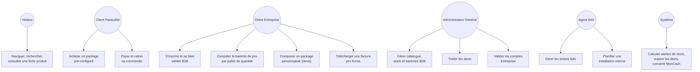

# CAHIER DES CAS D'UTILISATION

## Plateforme E-commerce B2B/B2C — Électronique & Énergie Solaire (ATC — Alpha Tech Center)

---

### Page de garde

| | |
|---|---|
| **Projet** | Plateforme e-commerce Électronique, Énergie Solaire, Sécurité & Climatisation |
| **Client** | ATC (Alpha Tech Center) |
| **Type de document** | Cahier des Cas d'Utilisation (Document 5/15) |
| **Version** | 1.0 |
| **Date** | 01/08/2026 |
| **Statut** | Version finale — en attente de validation client |
| **Documents parents** | Cahier de Vision (Doc. 1/15), PRD (Doc. 2/15), Besoins Fonctionnels (Doc. 3/15), Règles Métiers (Doc. 4/15) |
| **Diffusion** | Direction, Produit, UX/UI, Développement, QA, DevOps |
| **Confidentialité** | Document interne — usage projet uniquement |

---

### Historique des versions

| Version | Date | Auteur | Description |
|---|---|---|---|
| 0.1 | 01/08/2026 | Architecte Produit (IA) | Rédaction initiale des cas d'utilisation par domaine |
| 1.0 | 01/08/2026 | Architecte Produit (IA) | Version finale après auto-évaluation et intégration des améliorations |

---

### Sommaire

1. Introduction
2. Méthodologie et légende
3. Acteurs du système
4. Diagramme de cas d'utilisation global
5. Cas d'utilisation détaillés
6. Synthèse des cas d'utilisation complémentaires (traitement allégé)
7. Risques
8. Hypothèses
9. Décisions actées
10. Questions restantes
11. Traçabilité et documents liés
12. Conclusion

<!-- pagebreak -->

## 1. Introduction

Ce cahier déroule les besoins fonctionnels (Cahier 3) et les règles de gestion (Cahier 4) en **cas d'utilisation concrets**, décrivant pas à pas les interactions entre chaque acteur et la plateforme : scénario nominal, scénarios alternatifs, scénarios d'erreur, préconditions et postconditions.

Une attention particulière est portée aux parcours issus du recadrage majeur du projet : le barème de prix B2B par palier de quantité, le processus de validation d'un compte Entreprise en 4 étapes, le cycle de vie du devis (avec expiration à 3 jours), et le retrait de commande (aucune livraison n'étant proposée).

Les cas d'utilisation les plus complexes ou les plus différenciants font l'objet d'une description complète (section 5). Les cas d'utilisation plus simples, essentiellement descriptifs, sont regroupés dans un tableau de synthèse (section 6) pour éviter toute redondance avec le Cahier des Besoins Fonctionnels.

## 2. Méthodologie et légende

**Convention d'identifiant :** `UC-[N° Epic]-[N° séquentiel]`, ex. `UC-04-002` = 2ᵉ cas d'utilisation de l'EPIC-04 (Devis & Packages).

**Structure de chaque cas d'utilisation détaillé :**
- **Acteur principal / Acteurs secondaires**
- **Objectif**
- **Préconditions**
- **Déclencheur**
- **Scénario nominal** (étapes numérotées)
- **Scénarios alternatifs** (A1, A2…)
- **Scénarios d'erreur** (E1, E2…)
- **Postconditions** (succès / échec)
- **Règles métier associées** (`RG-XX-NNN`)
- **Besoins fonctionnels associés** (`BF-XX-NNN`)
- **Priorité** (héritée du Cahier 3)

<!-- pagebreak -->

## 3. Acteurs du système

| Acteur | Description | Repris de |
|---|---|---|
| **Visiteur (VIS)** | Internaute non connecté | Cahier 3 |
| **Client Particulier (CP)** | Compte Particulier, achat direct | Cahier 1, section 5 |
| **Client Entreprise (CE)** | Compte Entreprise, avec ou sans statut « B2B vérifié » | Cahier 1, section 5 |
| **Administrateur Général (ADM-G)** | Accès complet au back-office | Cahier 4, RG-12-001 |
| **Agent SAV/Support (ADM-S)** | Accès restreint (Devis, Commandes, Clients, Assistance/SAV) | Cahier 4, RG-12-001 |
| **Système (SYS)** | Comportements automatiques (calculs, notifications, expirations) | Cahier 3 |

## 4. Diagramme de cas d'utilisation global

<!-- pagebreak -->

## 5. Cas d'utilisation détaillés

### UC-03-001 — Consulter une fiche produit et son barème de prix B2B

**Acteur principal :** Client Entreprise (CE) — **Acteur secondaire :** Système (SYS)
**Objectif :** Permettre à un client Entreprise de consulter le prix applicable selon la quantité souhaitée, sans négociation manuelle.
**Préconditions :** Le produit existe et dispose d'au moins un palier de prix B2B défini par l'administrateur (BF-12-002).
**Déclencheur :** Le client Entreprise, connecté, accède à la fiche d'un produit éligible B2B.

**Scénario nominal :**
1. Le client Entreprise consulte la fiche produit.
2. Le système vérifie que le compte est au statut « B2B vérifié » (RG-08-001).
3. Le système affiche le tableau des paliers de prix (`[quantité min–max] → prix unitaire`).
4. Le client sélectionne une quantité.
5. Le système affiche immédiatement le prix unitaire et le total correspondant au palier applicable.
6. Le client ajoute le produit au panier à ce prix (→ UC-05-001).

**Scénarios alternatifs :**
- **A1 — Compte Entreprise non encore vérifié :** le système affiche le prix public (RG-03-001) et un message invitant à finaliser la validation du compte (→ UC-08-001/002).
- **A2 — Quantité saisie hors de tous les paliers définis :** le système applique le palier le plus proche disponible (le plus élevé défini) et affiche un message informatif.

**Scénarios d'erreur :**
- **E1 — Aucun palier défini pour ce produit :** le système affiche le prix public par défaut.

**Postconditions :** Le prix affiché et ajouté au panier correspond exactement au palier de quantité sélectionné.
**Règles métier associées :** RG-03-001, RG-03-004, RG-08-001.
**Besoins fonctionnels associés :** BF-03-005, BF-03-007.
**Priorité :** Must have.

---

### UC-04-001 — Acheter un package solaire pré-configuré (achat direct)

**Acteur principal :** Client (CP ou CE)
**Objectif :** Permettre un achat immédiat d'un système solaire standard, sans passer par le circuit de devis.
**Préconditions :** Un package pré-configuré est publié et disponible (BF-04-001).
**Déclencheur :** Le client sélectionne un package pré-configuré dans le catalogue.

**Scénario nominal :**
1. Le client consulte le catalogue de packages pré-configurés.
2. Le client sélectionne un package et l'ajoute au panier.
3. Le client procède au paiement (→ UC-06-001 ou UC-06-002).
4. Le système confirme la commande et la place au statut « En préparation » puis « Prête pour retrait » (→ UC-05-002).

**Scénarios alternatifs :**
- **A1 — Client Entreprise vérifié :** le prix appliqué tient compte du barème B2B si applicable au package (RG-03-004).

**Scénarios d'erreur :**
- **E1 — Package indisponible (rupture d'un composant) :** le système empêche l'ajout au panier et affiche le statut de stock concerné (RG-03-002).

**Postconditions :** Commande créée et payée, sans étape de devis.
**Règles métier associées :** RG-03-002, RG-03-004.
**Besoins fonctionnels associés :** BF-04-001.
**Priorité :** Must have.

---

### UC-04-002 — Composer un package personnalisé et envoyer une demande de devis

**Acteur principal :** Client Entreprise (CE) ou Particulier (CP) — **Acteur secondaire :** Système (SYS)
**Objectif :** Permettre au client de configurer un système solaire sur-mesure et d'obtenir un devis.
**Préconditions :** Le générateur de package personnalisé est accessible (BF-04-002).
**Déclencheur :** Le client clique sur « Composer mon package personnalisé ».

**Scénario nominal :**
1. Le client sélectionne panneaux, batteries, régulateur et accessoires un à un.
2. Le système calcule un prix indicatif basé sur les barèmes de chaque composant, selon la quantité de chaque élément (RG-03-004).
3. Le client valide sa configuration.
4. Le système crée automatiquement une demande de devis au statut « En attente », avec le détail de la configuration, le profil client, et l'horodatage (RG-04-002).
5. Le client reçoit une confirmation et peut suivre le statut dans son espace client (BF-04-004).

**Scénarios alternatifs :**
- **A1 — Client non connecté :** le système invite à la création de compte ou à la connexion avant validation de la configuration.

**Scénarios d'erreur :**
- **E1 — Composant en rupture de stock :** le système signale le composant concerné et empêche la validation tant qu'il n'est pas remplacé ou retiré.

**Postconditions :** Une demande de devis est créée au statut « En attente ».
**Règles métier associées :** RG-03-004, RG-04-001, RG-04-002.
**Besoins fonctionnels associés :** BF-04-002, BF-04-003.
**Priorité :** Must have — Epic différenciant.

---

### UC-04-003 — Traiter une demande de devis (côté administrateur)

**Acteur principal :** Administrateur Général (ADM-G)
**Objectif :** Répondre à une demande de devis avec un prix cohérent, sans négociation discrétionnaire.
**Préconditions :** Une demande de devis existe au statut « En attente ».
**Déclencheur :** L'administrateur ouvre une demande depuis l'onglet Devis du back-office (BF-12-004).

**Scénario nominal :**
1. L'administrateur consulte le détail de la configuration demandée.
2. Le système calcule automatiquement le prix total à partir des barèmes de chaque composant (RG-04-003).
3. L'administrateur ajoute, le cas échéant, le coût du service d'installation interne (RG-09-002).
4. L'administrateur envoie le devis au client ; le statut passe à « Répondu ».
5. Le système démarre le décompte du délai d'expiration de 3 jours (RG-04-005).

**Scénarios alternatifs :**
- **A1 — Configuration incomplète (ex. accessoires manquants) :** l'administrateur peut demander une clarification au client avant de répondre (statut reste « En attente »).

**Scénarios d'erreur :**
- **E1 — Composant retiré du catalogue depuis la demande initiale :** le système signale l'incohérence à l'administrateur avant envoi.

**Postconditions :** Le devis est au statut « Répondu », en attente de décision du client, avec expiration programmée à J+3.
**Règles métier associées :** RG-04-001, RG-04-003, RG-04-005, RG-09-002.
**Besoins fonctionnels associés :** BF-04-006.
**Priorité :** Must have.

---

### UC-04-004 — Accepter un devis et le convertir en commande

**Acteur principal :** Client (CP ou CE) — **Acteur secondaire :** Administrateur Général (ADM-G)
**Objectif :** Transformer un devis accepté en commande ferme.
**Préconditions :** Le devis est au statut « Répondu » et le délai de 3 jours n'est pas dépassé.
**Déclencheur :** Le client consulte son devis et clique sur « Accepter ».

**Scénario nominal :**
1. Le client accepte le devis ; le statut passe à « Accepté ».
2. L'administrateur convertit le devis en commande depuis le back-office (BF-04-007).
3. Le système fige le prix du devis (non modifiable a posteriori sans nouvelle validation — RG-04-004).
4. Le client procède au paiement (→ UC-06-001 ou UC-06-002).
5. Une facture pro forma est générée si le client est une Entreprise (→ UC-06-003).

**Scénarios alternatifs :**
- **A1 — Client refuse le devis :** le statut passe à « Refusé », fin du cas d'utilisation.

**Scénarios d'erreur :**
- **E1 — Client tente d'accepter un devis après expiration :** le système refuse l'action et invite à demander un nouveau devis (RG-04-005).

**Postconditions :** Commande créée avec prix figé, ou devis clos (refusé/expiré).
**Règles métier associées :** RG-04-001, RG-04-004, RG-04-005.
**Besoins fonctionnels associés :** BF-04-004, BF-04-007, BF-04-008.
**Priorité :** Must have.

---

### UC-05-001 — Ajouter un produit au panier avec prix par palier B2B

**Acteur principal :** Client Entreprise (CE) — **Acteur secondaire :** Système (SYS)
**Objectif :** Garantir que le prix du palier sélectionné sur la fiche produit est fidèlement repris dans le panier.
**Préconditions :** Le client a sélectionné une quantité et un prix de palier sur une fiche produit (→ UC-03-001).
**Déclencheur :** Clic sur « Ajouter au panier ».

**Scénario nominal :**
1. Le système reprend automatiquement le prix unitaire du palier sélectionné.
2. Le produit est ajouté au panier avec la quantité et le prix figés.
3. Le résumé de commande affiche le sous-total par catégorie (BF-05-002).

**Scénarios d'erreur :**
- **E1 — Modification de la quantité directement dans le panier :** le système recalcule le palier applicable et met à jour le prix en conséquence.

**Postconditions :** Le panier reflète exactement le prix du palier de quantité applicable.
**Règles métier associées :** RG-03-004.
**Besoins fonctionnels associés :** BF-05-002, BF-05-003.
**Priorité :** Must have.

---

### UC-05-002 — Retirer sa commande

**Acteur principal :** Client (CP ou CE) — **Acteur secondaire :** Système (SYS)
**Objectif :** Informer le client des modalités de récupération de sa commande, en l'absence de tout service de livraison.
**Préconditions :** La commande est payée et préparée par l'équipe ATC.
**Déclencheur :** La commande est prête.

**Scénario nominal :**
1. Le système fait passer la commande au statut « Prête pour retrait ».
2. Le système notifie le client (email et/ou espace client) avec le lieu et les horaires de retrait.
3. Le client se présente pour récupérer sa commande, selon les modalités communiquées.
4. L'administrateur marque la commande comme « Retirée » dans le back-office.

**Scénarios d'erreur :**
- **E1 — Client ne se présente pas dans un délai raisonnable :** processus de relance géré manuellement par l'équipe ATC (hors périmètre système en V1).

**Postconditions :** Commande retirée par le client, sans intervention d'un service de livraison.
**Règles métier associées :** RG-05-001.
**Besoins fonctionnels associés :** BF-05-004.
**Priorité :** Must have.

---

### UC-06-001 — Payer une commande via MonCash

**Acteur principal :** Client (CP ou CE) — **Acteur secondaire :** Système (SYS)
**Objectif :** Permettre un paiement en gourdes via MonCash, alors que l'affichage du site est en USD.
**Préconditions :** Un panier ou un devis accepté est prêt à être payé.
**Déclencheur :** Le client sélectionne MonCash comme moyen de paiement.

**Scénario nominal :**
1. Le système affiche le montant total en USD.
2. Le client sélectionne MonCash.
3. Le système convertit automatiquement le montant en HTG selon le taux de change interne défini par l'administrateur (RG-06-003, RG-06-004).
4. Le client confirme le paiement en HTG via MonCash.
5. Le système valide la transaction et confirme la commande.

**Scénarios d'erreur :**
- **E1 — Échec de la transaction MonCash :** le système affiche un message d'erreur et propose de réessayer ou de choisir un autre moyen de paiement.

**Postconditions :** Paiement confirmé, montant HTG conforme au taux interne en vigueur au moment de la transaction.
**Règles métier associées :** RG-06-001, RG-06-003, RG-06-004.
**Besoins fonctionnels associés :** BF-06-001, BF-06-006.
**Priorité :** Must have.

---

### UC-06-002 — Payer par carte Visa/Mastercard ou PayPal

**Acteur principal :** Client (CP ou CE)
**Objectif :** Permettre un paiement international sans conversion de devise.
**Préconditions :** Un panier ou un devis accepté est prêt à être payé.
**Déclencheur :** Le client sélectionne Carte ou PayPal.

**Scénario nominal :**
1. Le système affiche le montant total en USD.
2. Le client confirme le paiement via la passerelle correspondante.
3. Le système valide la transaction et confirme la commande.

**Scénarios d'erreur :**
- **E1 — Paiement refusé par la banque/PayPal :** le système affiche le motif si disponible et propose de réessayer.

**Postconditions :** Paiement confirmé en USD.
**Règles métier associées :** RG-06-001, RG-06-004.
**Besoins fonctionnels associés :** BF-06-002, BF-06-003.
**Priorité :** Must have.

---

### UC-06-003 — Télécharger une facture pro forma

**Acteur principal :** Client Entreprise (CE) — **Acteur secondaire :** Système (SYS)
**Objectif :** Fournir un document conforme, incluant la taxe applicable, pour la comptabilité du client.
**Préconditions :** Un devis a été accepté par un client Entreprise (→ UC-04-004).
**Déclencheur :** Acceptation du devis.

**Scénario nominal :**
1. Le système génère automatiquement une facture pro forma numérotée séquentiellement.
2. La facture inclut : identité ATC, identité client, détail produits/prix, conditions de paiement, devise (USD), taxe locale de 10 % (RG-06-002).
3. Le client télécharge la facture depuis son espace client.

**Scénarios d'erreur :**
- **E1 — Anomalie de calcul de la taxe (cas limite, ex. arrondi) :** le système signale l'écart à l'administrateur avant mise à disposition du client.

**Postconditions :** Facture pro forma disponible au téléchargement.
**Règles métier associées :** RG-06-002.
**Besoins fonctionnels associés :** BF-06-005.
**Priorité :** Must have.

---

### UC-08-001 — S'inscrire en tant que compte Entreprise (étapes 1 et 2)

**Acteur principal :** Client Entreprise (CE)
**Objectif :** Collecter les informations et documents nécessaires à la validation B2B.
**Préconditions :** Aucune (visiteur non connecté).
**Déclencheur :** Le visiteur choisit « Créer un compte Entreprise ».

**Scénario nominal :**
1. **Étape 1 — Inscription :** le visiteur renseigne nom légal, nom commercial (si différent), NIF, registre de commerce (si disponible), adresse, téléphone professionnel, email professionnel, nom et fonction du représentant, secteur d'activité, taille (optionnel).
2. **Étape 2 — Documents :** le visiteur téléverse patente/licence commerciale, NIF, registre de commerce (si applicable), pièce d'identité du représentant.
3. Le système crée le compte au statut « Entreprise — en attente de vérification ».
4. Le client peut naviguer et voir les prix publics, mais pas encore les barèmes B2B.

**Scénarios d'erreur :**
- **E1 — Document manquant ou format non supporté :** le système bloque la soumission et signale le champ concerné.
- **E2 — Email professionnel jugé non cohérent avec le nom de domaine de l'entreprise (contrôle différé à l'étape 3) :** signalé à l'administrateur, pas bloquant pour le client à ce stade.

**Postconditions :** Dossier Entreprise complet, en attente de vérification administrateur.
**Règles métier associées :** RG-08-001.
**Besoins fonctionnels associés :** BF-08-001, BF-08-006, BF-08-007.
**Priorité :** Must have.

---

### UC-08-002 — Valider un compte Entreprise (étapes 3 et 4)

**Acteur principal :** Administrateur Général (ADM-G)
**Objectif :** Vérifier et activer un compte Entreprise avant accès aux avantages B2B.
**Préconditions :** Un dossier Entreprise est complet et en attente de vérification (→ UC-08-001).
**Déclencheur :** L'administrateur ouvre le dossier depuis l'onglet Clients du back-office (BF-12-006).

**Scénario nominal :**
1. **Étape 3 — Vérification :** l'administrateur examine les informations saisies, les documents téléversés, et la cohérence de l'email professionnel (et du site web le cas échéant).
2. L'administrateur choisit une décision : **Approuver**, **Rejeter**, ou **Demander des informations complémentaires**.
3. **Étape 4 — Activation (si approuvé) :** le système fait passer le compte au statut « B2B vérifié ».
4. Le client reçoit une notification et accède désormais aux barèmes de prix, aux devis, et à la facturation pro forma.

**Scénarios alternatifs :**
- **A1 — Demande d'informations complémentaires :** le dossier retourne à l'étape 2 côté client ; le statut reste « en attente de vérification ».

**Scénarios d'erreur :**
- **E1 — Rejet du dossier :** le compte reste au statut « Entreprise — rejeté » ; le client conserve un accès Particulier standard.

**Postconditions :** Compte au statut « B2B vérifié », « en attente », ou « rejeté ».
**Règles métier associées :** RG-08-001.
**Besoins fonctionnels associés :** BF-08-008, BF-08-009.
**Priorité :** Must have.

---

### UC-09-001 — Planifier une installation interne

**Acteur principal :** Client (CP ou CE) — **Acteurs secondaires :** Administrateur Général (ADM-G), Agent SAV (ADM-S)
**Objectif :** Coordonner l'intervention de l'équipe technique interne pour un système solaire acheté.
**Préconditions :** Une commande de système solaire (package pré-configuré ou personnalisé) est payée.
**Déclencheur :** Le client demande une date d'installation depuis son espace client.

**Scénario nominal :**
1. Le système vérifie l'éligibilité du produit (famille Énergie solaire — RG-09-002).
2. Le client propose une date/plage horaire.
3. L'agent SAV ou l'administrateur confirme ou propose un ajustement selon la disponibilité de l'équipe.
4. L'installation est planifiée ; le client reçoit une confirmation.

**Scénarios d'erreur :**
- **E1 — Produit non éligible à l'installation interne (ex. climatisation) :** le système n'affiche pas l'option de planification.

**Postconditions :** Rendez-vous d'installation confirmé.
**Règles métier associées :** RG-09-002.
**Besoins fonctionnels associés :** BF-09-004.
**Priorité :** Must have.

---

### UC-12-001 — Gérer le catalogue, le stock et les barèmes de prix B2B

**Acteur principal :** Administrateur Général (ADM-G)
**Objectif :** Maintenir à jour les produits, leur stock de référence et leurs paliers de prix B2B.
**Préconditions :** L'administrateur est authentifié avec le rôle « Général ».
**Déclencheur :** Accès à l'onglet Catalogue du back-office.

**Scénario nominal :**
1. L'administrateur crée ou modifie un produit (description, specs, images, prix public).
2. L'administrateur définit le stock actuel et le stock de référence (pour le calcul du pourcentage d'alerte — RG-03-002).
3. L'administrateur définit un ou plusieurs paliers de prix B2B (`quantité min–max → prix unitaire`) si le produit est éligible B2B (RG-03-004).
4. Le système recalcule immédiatement le statut de stock affiché en façade (En stock / Alerte orange / Alerte rouge / Rupture).

**Scénarios d'erreur :**
- **E1 — Chevauchement de paliers de quantité (ex. 1-10 et 5-20) :** le système bloque l'enregistrement et signale le conflit.

**Postconditions :** Catalogue, stock et barèmes à jour, immédiatement reflétés côté client.
**Règles métier associées :** RG-03-002, RG-03-004.
**Besoins fonctionnels associés :** BF-12-002.
**Priorité :** Must have.

## 6. Synthèse des cas d'utilisation complémentaires (traitement allégé)

Les cas d'utilisation suivants sont essentiellement descriptifs (peu ou pas de logique conditionnelle) et sont directement traçables aux besoins fonctionnels du Cahier 3, sans description pas-à-pas complète :

| UC | Titre | Acteur principal | BF associés | Priorité |
|---|---|---|---|---|
| UC-01-001 | Naviguer par catégorie et changer de langue | VIS, CLI | BF-01-001 à 004, 006 à 012 | Must/Should have |
| UC-02-001 | Rechercher et filtrer des produits | VIS, CLI | BF-02-001 à 004 | Must/Should have |
| UC-04-006 | Suivre l'historique de ses devis | CLI | BF-04-005 | Could have |
| UC-05-003 | Gérer plusieurs adresses (facturation) | CLI | BF-08-002 | Should have |
| UC-08-003 | Gérer sa liste de favoris | CLI | BF-08-004 | Should have |
| UC-08-004 | Consulter son historique de commandes et devis | CLI | BF-08-003 | Must have |
| UC-09-002 | Ouvrir un ticket SAV | CLI | BF-09-002 | Should have |
| UC-10-001 | Laisser un avis sur un produit acheté | CLI | BF-10-006 | Should have |
| UC-11-001 | Consulter la FAQ générale et par catégorie | VIS, CLI | BF-11-001, 002 | Must have |
| UC-11-002 | Consulter le blog | VIS, CLI | BF-11-003 | Could have |
| UC-11-003 | Contacter ATC via formulaire ou WhatsApp | VIS, CLI | BF-11-006, BF-09-003 | Must have |
| UC-12-002 | Consulter le tableau de bord (ventes, devis en attente, stock bas) | ADM-G | BF-12-001 | Must have |
| UC-12-003 | Modérer un avis client avant publication | ADM-G, ADM-S | BF-12-012 | Should have |
| UC-12-004 | Gérer le contenu (FAQ, blog, légal) | ADM-G | BF-12-011 | Must have |
| UC-12-005 | Configurer les paramètres généraux (langues, taux de change interne) | ADM-G | BF-12-015 | Must have |
| UC-12-006 | Gérer les comptes administrateurs (2 rôles fixes) | ADM-G | BF-12-014 | Should have |
| UC-13-001 | Sécuriser les transactions et les données personnelles | SYS | BF-13-001, 002 | Must have |
| UC-15-001 | Consulter les statistiques de ventes et de conversion des devis | ADM-G | BF-15-001 à 003 | Should/Could have |

<!-- pagebreak -->

## 7. Risques

| Risque | Impact | Niveau |
|---|---|---|
| Scénarios d'erreur du cycle de devis (UC-04-003/004) insuffisamment testés lors du développement, notamment autour de l'expiration à J+3 | Comportement incohérent en cas limite | Moyen |
| Chevauchement de paliers de prix B2B mal détecté en amont du contrôle back-office (UC-12-001) | Prix incohérent affiché au client | Moyen |
| Processus de relance client en cas de non-retrait de commande (UC-05-002, E1) non outillé en V1 | Charge manuelle pour l'équipe ATC | Faible |

## 8. Hypothèses

Aucune hypothèse supplémentaire n'a été nécessaire à ce stade. Toutes les hypothèses du Cahier des Règles Métiers sont désormais résolues.

## 9. Décisions actées

Reprises à l'identique du Cahier des Règles Métiers (section 7), sans modification. Voir Cahier 4 pour la table complète des 39 décisions.

## 10. Questions restantes

Aucune nouvelle question n'a émergé lors de la rédaction de ce cahier. La question résiduelle du Cahier 4 est désormais résolue (voir Cahier 4, décision actée n°28).

## 11. Traçabilité et documents liés

Chaque cas d'utilisation `UC-XX-NNN` référence un ou plusieurs besoins `BF-XX-NNN` (Cahier 3) et règles `RG-XX-NNN` (Cahier 4). Ces cas d'utilisation seront directement repris :

- Dans le **Cahier des Spécifications Fonctionnelles Détaillées (Cahier 6)**, pour la description écran par écran de chaque étape.
- Dans le **Cahier UX/UI (Cahier 7)**, pour la conception des parcours et des états (vide, chargement, erreur, succès).
- Dans le **Cahier des Tests (Cahier 12)**, où chaque scénario nominal, alternatif et d'erreur donnera lieu à un ou plusieurs cas de test.

## 12. Conclusion

Ce cahier détaille **14 cas d'utilisation majeurs** avec scénarios complets, et recense **18 cas d'utilisation complémentaires** à traitement allégé, couvrant l'ensemble des 92 besoins fonctionnels du Cahier 3. Une attention particulière a été portée aux parcours issus du recadrage du projet (barème B2B, validation Entreprise en 4 étapes, cycle de devis avec expiration à 3 jours, retrait sans livraison).

Aucune question bloquante n'a émergé ; la rédaction peut se poursuivre avec le **Cahier des Spécifications Fonctionnelles Détaillées (Cahier 6)**.

---

*Fin du Cahier des Cas d'Utilisation — Document 5/15*
