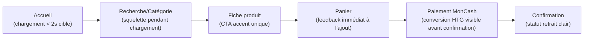
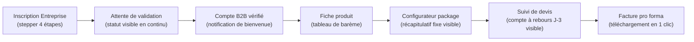

# CAHIER UX/UI

## Plateforme E-commerce B2B/B2C — Électronique & Énergie Solaire (ATC — Alpha Tech Center)

---

### Page de garde

| | |
|---|---|
| **Projet** | Plateforme e-commerce Électronique, Énergie Solaire, Sécurité & Climatisation |
| **Client** | ATC (Alpha Tech Center) |
| **Type de document** | Cahier UX/UI (Document 7/15) |
| **Version** | 1.2 |
| **Date** | 01/08/2026 |
| **Statut** | Version finale — validée, palette officielle mesurée sur le logo reçu |
| **Documents parents** | Cahier de Vision (Doc. 1/15), Besoins Fonctionnels (Doc. 3/15), Règles Métiers (Doc. 4/15), Cas d'Utilisation (Doc. 5/15), Spécifications Fonctionnelles Détaillées (Doc. 6/15) |
| **Diffusion** | Direction, Produit, UX/UI, Développement, QA, DevOps |
| **Confidentialité** | Document interne — usage projet uniquement |

---

### Historique des versions

| Version | Date | Auteur | Description |
|---|---|---|---|
| 0.1 | 01/08/2026 | Architecte Produit / Lead UX-UI (IA) | Rédaction initiale : design system et écrans prioritaires |
| 1.0 | 01/08/2026 | Architecte Produit / Lead UX-UI (IA) | Version finale après auto-évaluation et intégration des améliorations |
| 1.1 | 01/08/2026 | Architecte Produit / Lead UX-UI (IA) | Palette et typographie confirmées comme base de travail (décision actée n°31) |
| 1.2 | 01/08/2026 | Architecte Produit / Lead UX-UI (IA) | Logo officiel reçu ; palette remplacée par les couleurs mesurées directement dessus (décision actée n°39) |

---

### Sommaire

1. Introduction et périmètre
2. Identité visuelle et fondations du design system
3. Principes UX transverses
4. Bibliothèque de composants UI réutilisables
5. Parcours utilisateurs optimisés
6. Spécifications UX/UI — écrans prioritaires (traitement complet)
7. Spécifications UX/UI — écrans complémentaires (traitement synthétique)
8. Accessibilité (WCAG 2.2 AA)
9. Risques
10. Hypothèses
11. Décisions actées
12. Questions restantes
13. Traçabilité et documents liés
14. Conclusion

<!-- pagebreak -->

## 1. Introduction et périmètre

Ce cahier définit l'habillage visuel et l'expérience détaillée des écrans déjà spécifiés fonctionnellement au Cahier 6 : disposition, responsive, états visuels, micro-interactions, animations, et recommandations UX — dans le respect du positionnement **premium** défini au Cahier de Vision (section 3) et de la contrainte de **performance sur connexions faibles** (Cahier de Vision, section 11).

**Mise à jour :** le logo officiel d'ATC a été reçu (3 variantes) et ses couleurs ont été extraites directement par analyse colorimétrique (section 2.1) — la palette n'est plus une hypothèse mais une mesure sur la marque réelle. Une charte graphique écrite formelle (règles d'usage précises, marges de protection, variantes autorisées) n'a pas été fournie séparément ; si elle existe, sa transmission permettra d'affiner les règles d'usage du logo sans remettre en cause la palette déjà extraite. La typographie (Sora/Inter) reste une proposition, aucune police officielle n'ayant été communiquée.

## 2. Identité visuelle et fondations du design system

### 2.1 Palette de couleurs (confirmée — extraite du logo réel d'ATC)

*Mise à jour : le logo officiel d'Alpha Tech Center a été reçu (3 variantes) et analysé par extraction colorimétrique directe des pixels. Les couleurs primaire et d'accent ci-dessous ne sont plus une proposition mais des **valeurs mesurées sur la marque réelle**. Seule une charte graphique écrite formelle (règles d'usage, variantes du logo, marges de protection) reste à recevoir le cas échéant — elle n'empêche pas d'intégrer ces couleurs dès maintenant.*

| Rôle | Couleur | Code (mesuré sur le logo) | Justification |
|---|---|---|---|
| Primaire | Bleu ATC | `#014DAB` | Bleu dominant du logo (forme « A » et texte « ALPHATECH CENTER ») |
| Primaire (variante claire) | Bleu électrique | `#018DDE` | Ton bleu clair du logo (icône éclair/électricité) |
| Accent (CTA) | Orange-rouge ATC | `#FE4028` | Couleur de l'éclair/soleil du logo — forte présence, à réserver aux actions principales |
| Succès | Vert | `#2E7D32` | Confirmations, statuts positifs (couleur neutre, non présente dans le logo) |
| Avertissement | Orange | `#F57C00` | **Réutilisé pour l'alerte de stock ≤ 40 %** (RG-03-002) — distinct de l'accent CTA pour ne pas créer de confusion |
| Danger | Rouge | `#D32F2F` | **Réutilisé pour l'alerte de stock ≤ 15 %** (RG-03-002) et les erreurs |
| Neutre fond | Gris très clair | `#F7F8FA` | Fond de page, sobre et reposant |
| Neutre bordure | Gris clair | `#E1E4E8` | Séparateurs, bordures de champs |
| Texte secondaire | Gris moyen | `#6B7280` | Légendes, métadonnées |
| Texte principal | Gris anthracite | `#1F2937` | Corps de texte, meilleure lisibilité qu'un noir pur |

*Point de vigilance : l'accent CTA (`#FE4028`) et la couleur Avertissement (`#F57C00`) sont proches en teinte (orange/rouge). Un test de contraste et de distinction visuelle est recommandé en phase de prototypage pour s'assurer qu'un bouton d'action n'est jamais confondu avec une alerte de stock.*

### 2.2 Typographie (confirmée — décision actée n°43)

*ATC ne dispose pas de polices de marque officielles et délègue ce choix à l'équipe projet, du moment qu'il s'harmonise avec l'identité visuelle du logo (bleu ATC, accent orange-rouge). Ce n'est donc plus une proposition mais un choix définitif.*

| Usage | Police | Justification |
|---|---|---|
| Titres | Sora (Google Fonts, 2 graisses : 600/700) | Géométrique, moderne, forte présence premium — s'accorde avec la forme géométrique du logo |
| Corps de texte | Inter (Google Fonts, 2 graisses : 400/500) | Excellente lisibilité, bon support des accents FR/ES, très performante |

**Recommandation performance (cohérente avec la contrainte de connexions faibles, Cahier de Vision) :** limiter à 4 fichiers de police au total (2 graisses × 2 familles), les sous-charger en `font-display: swap`, et prévoir une pile de secours système (`-apple-system, Segoe UI, Roboto, sans-serif`) pour un rendu immédiat pendant le chargement.

### 2.3 Grille et espacement

- Unité de base : **8 px** (espacements en multiples de 8 : 8, 16, 24, 32, 48…).
- Grille desktop : 12 colonnes, marge extérieure 24 px.
- Grille mobile : 4 colonnes, marge extérieure 16 px.
- Points de rupture : mobile < 640 px · tablette 640–1024 px · desktop > 1024 px.

### 2.4 Iconographie

Style trait fin (line icons), épaisseur de trait constante (1,5 px), taille standard 24 px (16 px en contexte dense comme les tableaux admin). Recommandation : une seule bibliothèque cohérente sur l'ensemble du site (ex. famille de type Lucide/Feather) plutôt que de mélanger plusieurs styles.

## 3. Principes UX transverses

- **Mobile-first :** chaque écran est conçu d'abord pour mobile (usage majoritaire probable en Haïti), puis enrichi progressivement pour tablette/desktop.
- **Hiérarchie visuelle claire :** un seul appel à l'action primaire par écran (couleur accent réservée à cet usage) ; actions secondaires en style discret (ghost/outline).
- **Cohérence graphique :** les composants du design system (section 4) sont réutilisés à l'identique sur tout le site et le back-office, pour réduire la charge cognitive.
- **Performance perçue :** état de chargement systématique (squelettes plutôt que spinners génériques) pour donner une impression de rapidité même sur connexion lente.
- **Clarté du double parcours** (achat direct vs devis) : le bouton « Ajouter au panier » et le bouton « Ajouter au package personnalisé » doivent être visuellement distincts (couleur/style différents) pour éviter la confusion identifiée comme risque UX majeur dès le Cahier de Vision.

## 4. Bibliothèque de composants UI réutilisables

| Composant | Usage | Variantes |
|---|---|---|
| Bouton | Actions | Primaire (accent), Secondaire (outline), Ghost (texte seul), Danger |
| Badge de stock | Indicateur de disponibilité | Vert « En stock », Orange « Stock faible », Rouge « Stock critique », Gris « Rupture » |
| Tableau de barème B2B | Fiche produit | Lignes de palier avec plage de quantité + prix, ligne active surlignée selon la quantité saisie |
| Stepper (indicateur d'étapes) | Inscription Entreprise (4 étapes) | États : à venir / en cours / complété |
| Étiquette de statut (devis, commande) | Suivi devis/commande | En attente (gris), Répondu (bleu), Accepté (vert), Refusé/Expiré (rouge), Prête pour retrait (ambre) |
| Carte produit | Listes de produits | Image, nom, prix, badge de stock |
| Champ de formulaire | Formulaires | États : normal, focus, erreur, désactivé |
| Modale | Confirmations, détails | Fond assombri, fermeture par Échap/clic extérieur |
| Notification (toast) | Retours d'action | Succès, erreur, information |
| Onglets | Back-office | Navigation entre sections d'un même module |
| Tableau de données | Back-office (catalogue, commandes, clients) | Tri, pagination, filtres en en-tête |
| État vide | Listes sans résultat | Illustration légère + message + action suggérée |
| Squelette de chargement | Tout écran à chargement asynchrone | Formes grises animées reproduisant la structure finale |

<!-- pagebreak -->

## 5. Parcours utilisateurs optimisés

**Parcours — Particulier en Haïti (achat direct), enrichi UX :**



**Parcours — Entreprise (barème B2B + devis), enrichi UX :**



*Recommandation : afficher le compte à rebours avant expiration du devis (3 jours) de façon visible mais non anxiogène — un simple texte relatif (« Expire dans 2 jours ») plutôt qu'un chronomètre.*

## 6. Spécifications UX/UI — écrans prioritaires (traitement complet)

### ECR-01-001 — Page d'accueil

**Disposition (mobile → desktop) :**
```
┌─────────────────────────────┐
│ Header : logo | recherche(≡) │
│ menu catégories (drawer mob.)│
├─────────────────────────────┤
│ Bannière packages solaires   │
├─────────────────────────────┤
│ Catégories phares (cartes)   │
├─────────────────────────────┤
│ Bloc « Devenir client pro »  │
├─────────────────────────────┤
│ Réassurance (3 icônes)       │
└─────────────────────────────┘
```
Sur desktop, le menu catégories passe en barre horizontale permanente ; les catégories phares passent de 1 colonne (mobile) à 3-4 colonnes.

**Interactions :** menu catégories en tiroir (drawer) sur mobile, survol avec sous-menu sur desktop.
**États visuels :** squelette de bannière pendant le chargement des packages mis en avant ; en cas d'échec, un visuel statique de secours reste affiché (jamais d'écran vide).
**Micro-interactions :** légère mise à l'échelle (scale 1.02) au survol des cartes catégories (desktop uniquement).
**Animations :** apparition en fondu léger (200 ms) des blocs au défilement, désactivée si `prefers-reduced-motion` est actif.
**Recommandations UX :** limiter la bannière à une seule image optimisée (format WebP, poids < 150 Ko) pour respecter la contrainte de performance.

---

### ECR-03-001 — Fiche produit (avec barème B2B)

**Disposition (desktop) :**
```
┌───────────────┬─────────────────────────┐
│               │ Nom du produit           │
│  Galerie      │ Prix + badge de stock    │
│  d'images     ├─────────────────────────┤
│               │ [Tableau barème B2B]     │
│               │  Qté     Prix unitaire   │
│               │  1-9     $XX             │
│               │  10-49   $XX  ← surligné │
│               │  50+     $XX             │
│               ├─────────────────────────┤
│               │ [Ajouter au panier]      │
│               │ [Ajouter au package] (2e)│
├───────────────┴─────────────────────────┤
│ Produits associés (carrousel)            │
├───────────────────────────────────────────┤
│ Avis clients                             │
└───────────────────────────────────────────┘
```
Sur mobile, la galerie passe au-dessus en pleine largeur, le tableau de barème devient scrollable horizontalement si nécessaire.

**Interactions :** saisie de quantité avec boutons +/-, mise à jour du prix total en temps réel sans rechargement de page ; ligne du palier actif visuellement surlignée dans le tableau.
**États visuels :** badge de stock coloré (vert/orange/rouge/gris) toujours visible near le prix ; état rupture désactive visuellement (grisé) le bouton « Ajouter au panier » tout en gardant actif « Ajouter au package personnalisé ».
**Micro-interactions :** confirmation visuelle brève (icône + texte, 1,5 s) lors de l'ajout au panier, sans quitter la page.
**Animations :** transition douce (150 ms) lors du changement de palier actif dans le tableau.
**Recommandations UX :** le bouton « Ajouter au panier » (accent) et « Ajouter au package personnalisé » (secondaire/outline) doivent être visuellement hiérarchisés différemment pour lever toute ambiguïté (risque UX identifié au Cahier de Vision).

---

### ECR-04-002 — Configurateur de package personnalisé

**Disposition :** structure en étapes horizontales (desktop) ou verticales empilées (mobile), avec un **récapitulatif fixe** (sticky) affichant le prix indicatif total et le nombre d'éléments sélectionnés, toujours visible pendant la configuration.
**Interactions :** ajout/retrait de composants par cartes sélectionnables (pas de menu déroulant, pour un choix plus visuel et engageant) ; le récapitulatif se met à jour instantanément à chaque sélection.
**États visuels :** composant en rupture affiché grisé avec badge rouge, non sélectionnable ; état vide initial avec message d'invitation à commencer.
**Micro-interactions :** légère animation de « rebond » sur le récapitulatif fixe à chaque ajout, pour confirmer visuellement la prise en compte sans être intrusif.
**Animations :** transition fluide entre les étapes (glissement horizontal léger, 250 ms), désactivable via `prefers-reduced-motion`.
**Recommandations UX :** afficher un indicateur de progression discret (ex. « 3 éléments sélectionnés ») plutôt qu'une barre de progression classique, la configuration n'étant pas strictement linéaire.

---

### ECR-04-003 — Suivi de devis (espace client)

**Disposition :** liste de cartes « devis », chacune avec étiquette de statut colorée (composant section 4), date, montant, et bouton d'action contextuel (Accepter/Refuser si « Répondu »).
**États visuels :** devis proche de l'expiration (< 24h) mis en évidence par une bordure ambre discrète, sans alarmisme visuel excessif.
**Micro-interactions :** confirmation par modale avant l'action « Accepter » (engagement financier), pas de confirmation nécessaire pour « Refuser ».
**Animations :** aucune animation complexe nécessaire ; simple transition d'état de la carte lors du changement de statut.
**Recommandations UX :** afficher le délai restant en texte relatif (« Expire dans 2 jours ») plutôt qu'en date absolue, plus immédiatement compréhensible.

---

### ECR-05-001 — Panier

**Disposition :** liste de lignes produits (image miniature, nom, quantité modifiable, prix, sous-total), sous-totaux par catégorie repliables, total général en évidence, CTA de paiement fixe en bas sur mobile.
**Interactions :** modification de quantité avec recalcul instantané (y compris re-sélection du palier B2B applicable) ; suppression d'un article avec confirmation légère (bouton « Annuler » dans le toast de suppression, 5 secondes).
**États visuels :** état vide avec illustration légère et lien vers le catalogue ; état de recalcul bref (indicateur discret) lors du changement de quantité.
**Micro-interactions :** le sous-total s'anime brièvement (highlight) lors de sa mise à jour, pour attirer l'œil sans être intrusif.
**Recommandations UX :** garder le CTA « Procéder au paiement » toujours visible (sticky) sur mobile pour limiter les frictions.

---

### ECR-06-001 — Paiement

**Disposition :** montant total en évidence en haut, sélection du moyen de paiement par cartes cliquables (MonCash / Carte / PayPal) plutôt qu'une liste déroulante, formulaire spécifique au moyen choisi affiché en dessous.
**Interactions :** dès sélection de MonCash, affichage immédiat (sans rechargement) du montant converti en HTG, avec mention claire du taux appliqué.
**États visuels :** état de traitement de la transaction avec indicateur de progression clair et message rassurant (« Ne fermez pas cette page ») ; état d'échec avec message explicite et bouton de nouvelle tentative.
**Micro-interactions :** léger état de focus visuel sur la carte du moyen de paiement sélectionné.
**Recommandations UX :** afficher les icônes officielles des moyens de paiement (MonCash, Visa/Mastercard, PayPal) pour renforcer la confiance, élément de réassurance identifié dès le Cahier de Vision.

---

### ECR-08-001 — Inscription Entreprise (étapes 1 et 2)

**Disposition :** stepper horizontal en 4 étapes en haut de page (composant section 4), formulaire de l'étape courante affiché seul (pas toutes les étapes en même temps), boutons « Précédent »/« Continuer » en bas.
```
[●───○───○───○]  Étape 1/4 : Inscription
┌─────────────────────────────┐
│ Nom légal *        [______] │
│ Nom commercial     [______] │
│ NIF *              [______] │
│ ...                          │
└─────────────────────────────┘
              [Continuer →]
```
**Interactions :** validation en temps réel des champs obligatoires (bordure rouge + message sous le champ dès la perte de focus si invalide) ; zone de dépôt de fichier par glisser-déposer à l'étape 2, avec liste des fichiers déjà ajoutés.
**États visuels :** étape complétée marquée d'un check vert dans le stepper ; message de succès clair à la soumission finale (« Dossier envoyé, vérification sous quelques jours »).
**Micro-interactions :** barre de progression du téléversement de chaque fichier.
**Recommandations UX :** afficher un exemple ou une info-bulle pour les champs pouvant prêter à confusion (ex. NIF, registre de commerce), utile pour une clientèle qui découvre potentiellement ce vocabulaire administratif en ligne.

---

### ECR-08-002 — Validation compte Entreprise (back-office)

**Disposition (back-office) :** liste de dossiers à gauche (filtrable par statut), détail du dossier sélectionné à droite avec aperçu des documents intégré (pas de téléchargement nécessaire pour consulter).
**Interactions :** boutons d'action groupés en bas du détail (Approuver / Rejeter / Demander compléments), avec zone de commentaire optionnelle pour motiver un rejet ou une demande.
**États visuels :** file d'attente triée par ancienneté par défaut, avec indicateur visuel des dossiers en attente depuis plus de 48h.
**Recommandations UX :** l'aperçu intégré des documents (plutôt qu'un lien de téléchargement) réduit fortement le temps de traitement par dossier pour l'administrateur.

---

### ECR-12-001 — Tableau de bord administrateur

**Disposition :** grille de widgets (cartes) — ventes du jour/mois, devis en attente, alertes de stock, dernières commandes, dossiers Entreprise en attente — chacun cliquable vers le module correspondant.
**États visuels :** widgets d'alerte (stock, devis en attente) mis en avant visuellement (bordure ou fond légèrement teinté) lorsque leur valeur dépasse un seuil d'attention.
**Recommandations UX :** prioriser visuellement les widgets actionnables (devis en attente, dossiers Entreprise) en haut de page, les widgets purement informatifs (ventes) en dessous.

<!-- pagebreak -->

## 7. Spécifications UX/UI — écrans complémentaires (traitement synthétique)

| ECR | Recommandation UX principale |
|---|---|
| ECR-01-002 (Catalogue) | Filtres en panneau latéral repliable sur mobile (bottom sheet), toujours visibles sur desktop |
| ECR-02-001 (Recherche) | Suggestions affichées dès 2 caractères saisis, avec image miniature par résultat |
| ECR-04-001 (Packages pré-configurés) | Mise en avant visuelle claire du prix « tout compris » pour rassurer sur l'absence de coûts cachés |
| ECR-04-004 (Traitement devis admin) | Calcul du prix (barèmes) affiché en lecture seule, distinct visuellement du champ éditable « coût d'installation » |
| ECR-05-002 (Confirmation/retrait) | Bloc modalités de retrait mis en évidence (encadré), jamais relégué en bas de page |
| ECR-06-002 (Facture pro forma) | Bouton de téléchargement visible sans défilement, aperçu PDF intégré si possible |
| ECR-08-003 (Espace client) | Statut du compte (Particulier/en attente/B2B vérifié) affiché en évidence en haut de l'espace client |
| ECR-12-002 (Gestion catalogue/barème) | Éditeur de paliers avec détection visuelle immédiate des chevauchements (bordure rouge sur les lignes en conflit) |
| ECR-09-001/002 (SAV, installation) | Formulaire court, champs pré-remplis avec les données de la commande concernée |
| ECR-10-001 (Avis) | Système d'étoiles simple, champ commentaire optionnel |
| ECR-11-001 à 004 (Contenu) | Typographie soignée, hiérarchie claire des titres, recherche interne à la FAQ |
| ECR-12-003 à 006 (Admin) | Tableaux de données avec tri, filtre et pagination cohérents sur tous les modules admin |
| ECR-15-001 (Statistiques) | Graphiques simples (barres/lignes), pas de surcharge visuelle |

## 8. Accessibilité (WCAG 2.2 AA)

- **Contraste :** ratio minimum 4,5:1 pour le texte standard, 3:1 pour le texte large — la palette proposée (section 2.1) a été choisie en conséquence (à revérifier avec la charte réelle d'ATC).
- **Navigation clavier :** tous les composants interactifs (boutons, champs, stepper, tableau de barème) doivent être accessibles et visibles au focus clavier (contour visible, jamais supprimé).
- **Lecteurs d'écran :** badges de stock et étiquettes de statut doivent porter un texte alternatif explicite (pas seulement une couleur) — ex. `aria-label="Stock critique"`.
- **Cibles tactiles :** taille minimale de 44×44 px sur mobile pour tous les éléments cliquables.
- **Mouvement réduit :** toutes les animations décrites dans ce cahier doivent être désactivées si `prefers-reduced-motion: reduce` est détecté.
- **Formulaires :** messages d'erreur explicites et associés programmatiquement au champ concerné (pas uniquement une couleur de bordure).

## 9. Risques

| Risque | Impact | Niveau |
|---|---|---|
| Palette et typographie proposées non conformes à la charte réelle d'ATC | Refonte visuelle partielle une fois les fichiers de marque reçus | Moyen |
| Tableau de barème B2B peu lisible sur petits écrans si le nombre de paliers est élevé | Frustration des clients B2B sur mobile | Moyen |
| Volume d'animations/micro-interactions sous-estimé en charge de développement frontend | Retard sur le Cahier d'Architecture / développement | Faible à moyen |

## 10. Hypothèses

- ~~La palette proposée~~ — **Résolue** : couleurs mesurées directement sur le logo officiel d'ATC reçu (section 2.1).
- ~~La typographie~~ — **Résolue** : Sora/Inter confirmées comme choix définitif (section 2.2, décision actée n°43).
- Le stepper à 4 étapes (inscription Entreprise) est supposé linéaire avec retour possible en arrière ; à confirmer en phase de prototypage.

## 11. Décisions actées

Reprises à l'identique du Cahier des Règles Métiers (section 7), sans modification. Voir Cahier 4 pour la table complète des 45 décisions (dont les n°39, 43 et 44, issues de ce cahier : palette et typographie officielles, absence de charte écrite).

## 12. Questions restantes

Aucune question ne subsiste dans ce cahier : la palette (n°39), la typographie (n°43), et l'absence de charte graphique écrite formelle (n°44 — seuls les fichiers logo font foi) sont désormais actées.

## 13. Traçabilité et documents liés

Ce cahier s'appuie directement sur les écrans du **Cahier des Spécifications Fonctionnelles Détaillées (Cahier 6)** et sera repris :

- Dans le **Cahier d'Architecture Logicielle (Cahier 8)**, pour le choix des technologies frontend capables de restituer ce design system avec les contraintes de performance.
- Dans le **Cahier des Exigences Non Fonctionnelles (Cahier 11)**, pour formaliser les cibles de performance (poids des pages, temps de chargement) et d'accessibilité.
- Dans le **Cahier des Tests (Cahier 12)**, pour les tests d'accessibilité et de responsive design.

## 14. Conclusion

Ce cahier établit les fondations visuelles (palette, typographie, grille, composants) et détaille l'expérience de **9 écrans prioritaires**, avec un traitement synthétique pour les 13 écrans complémentaires. Il respecte les contraintes de performance et l'exigence d'accessibilité WCAG 2.2 AA fixées dès le Cahier de Vision.

Le seul point réellement bloquant pour finaliser ce cahier est la réception des **fichiers de marque officiels d'ATC** ; en leur absence, la structure, les comportements et les recommandations UX décrits restent pleinement exploitables par les équipes de développement.

---

*Fin du Cahier UX/UI — Document 7/15*
