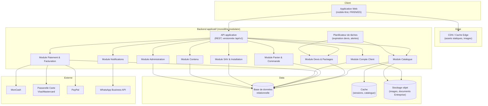
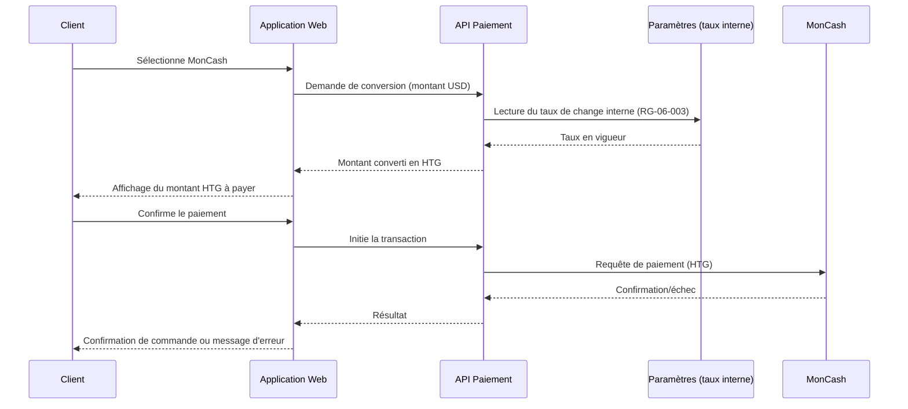
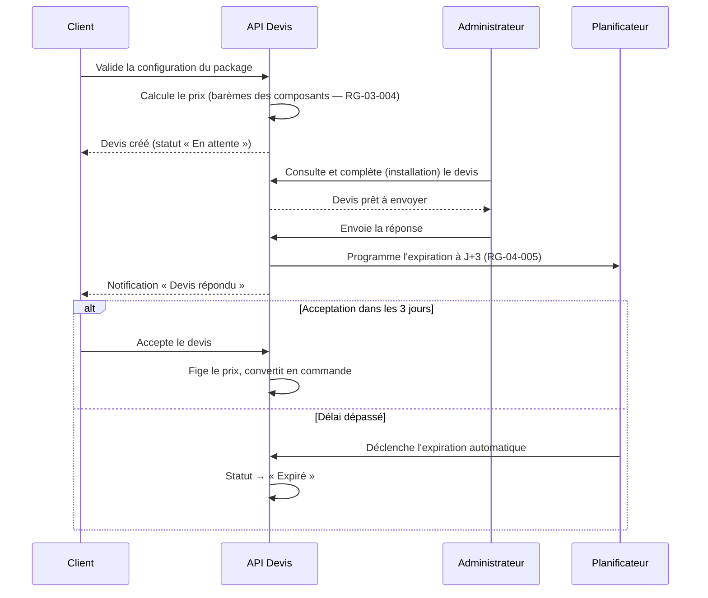

# CAHIER D'ARCHITECTURE LOGICIELLE

## Plateforme E-commerce B2B/B2C — Électronique & Énergie Solaire (ATC — Alpha Tech Center)

---

### Page de garde

| | |
|---|---|
| **Projet** | Plateforme e-commerce Électronique, Énergie Solaire, Sécurité & Climatisation |
| **Client** | ATC (Alpha Tech Center) |
| **Type de document** | Cahier d'Architecture Logicielle (Document 8/15) |
| **Version** | 1.1 |
| **Date** | 01/08/2026 |
| **Statut** | Version finale — validée, questions PSP et équipe de développement résolues |
| **Documents parents** | Cahier de Vision (Doc. 1/15), PRD (Doc. 2/15), Besoins Fonctionnels (Doc. 3/15), Règles Métiers (Doc. 4/15), Spécifications Détaillées (Doc. 6/15), UX/UI (Doc. 7/15) |
| **Diffusion** | Direction, Produit, Développement, QA, DevOps |
| **Confidentialité** | Document interne — usage projet uniquement |

---

### Historique des versions

| Version | Date | Auteur | Description |
|---|---|---|---|
| 0.1 | 01/08/2026 | Architecte Logiciel (IA) | Rédaction initiale de l'architecture cible |
| 1.0 | 01/08/2026 | Architecte Logiciel (IA) | Version finale après auto-évaluation et intégration des améliorations |
| 1.1 | 01/08/2026 | Architecte Logiciel (IA) | PSP laissé libre au prestataire (décision n°34) ; équipe de développement confirmée déjà identifiée par ATC (décision n°35) |

---

### Sommaire

1. Introduction et objectifs d'architecture
2. Principes directeurs
3. Style architectural retenu et justification
4. Vue d'ensemble de l'architecture
5. Découpage en modules applicatifs
6. Stack technique
7. Sécurité et conformité
8. Intégrations externes
9. Scalabilité et performance
10. Traitements asynchrones et tâches planifiées
11. Internationalisation (architecture)
12. Environnements et déploiement
13. Flux techniques clés
14. Risques
15. Hypothèses
16. Décisions actées
17. Questions restantes
18. Traçabilité et documents liés
19. Conclusion

<!-- pagebreak -->

## 1. Introduction et objectifs d'architecture

Ce cahier traduit en choix techniques concrets l'ambition de **plateforme scalable dès le départ** (décision actée n°6), tout en évitant la sur-ingénierie identifiée comme risque dès le Cahier de Vision (section 15) — la volumétrie cible actuelle étant d'environ **50 transactions par jour** (décision actée n°12), un ordre de grandeur modeste qui ne justifie pas une architecture distribuée complexe dès le lancement, mais qui doit pouvoir absorber une croissance significative sans refonte.

L'architecture proposée s'appuie directement sur le découpage en 15 modules du PRD (Cahier 2), les 92 besoins fonctionnels (Cahier 3) et les 21 règles de gestion (Cahier 4).

## 2. Principes directeurs

| Principe | Justification |
|---|---|
| **Séparation claire des responsabilités par domaine métier** | Facilite la maintenance et une éventuelle extraction future en services indépendants si le volume l'exige |
| **Statelessness des services applicatifs** | Condition nécessaire à la montée en charge horizontale sans refonte |
| **Pas de dépendance figée à un partenaire externe non confirmé** | Cohérent avec l'absence de partenaire logistique (décision n°27, sans objet) et la gestion interne du taux de change (décision n°24) |
| **Sobriété face à la contrainte de connectivité** | Cohérent avec la contrainte de performance sur connexions faibles (Cahier de Vision, section 11) |
| **Liberté de choix technique** | Permise par l'absence de contrainte budgétaire (décision actée n°7), mais sans complexité gratuite |
| **Auditabilité des calculs financiers** | Le calcul du barème B2B (RG-03-004), la conversion MonCash (RG-06-003/004) et la taxe (RG-06-002) sont des opérations sensibles, systématiquement exécutées et journalisées côté serveur, jamais côté client |

## 3. Style architectural retenu et justification

**Choix retenu : monolithe modulaire (« modular monolith »)**, organisé en modules métier fortement découplés à l'intérieur d'une seule base de code et d'un seul déploiement applicatif, avec des frontières de module strictes (API internes claires, pas d'accès direct aux données d'un autre module).

**Alternatives écartées et justification :**

| Alternative | Pourquoi écartée à ce stade |
|---|---|
| Microservices distribués dès le lancement | Complexité opérationnelle (orchestration, observabilité distribuée) disproportionnée pour ~50 transactions/jour ; correspond au risque de sur-ingénierie déjà identifié |
| Architecture serverless intégrale (FaaS) | Moins adaptée aux traitements transactionnels avec état (panier, devis) et aux temps de démarrage à froid, pénalisants sur connexions faibles |
| Monolithe non modulaire (« big ball of mud ») | Ne satisferait pas l'exigence de scalabilité dès le départ ni la maintenabilité à moyen terme |

**Trajectoire d'évolution :** chaque module (section 5) est conçu pour pouvoir être extrait en service indépendant ultérieurement (ex. si le module Devis & Packages devait un jour absorber un volume disproportionné), sans réécriture complète — c'est le sens concret donné à la décision actée n°6.

## 4. Vue d'ensemble de l'architecture

## 5. Découpage en modules applicatifs

| Module | Responsabilités | Epics/BF couverts |
|---|---|---|
| **Catalogue** | Produits, catégories, marques, stock et stock de référence, barèmes de prix B2B, packages pré-configurés | EPIC-01, 02, 03 |
| **Devis & Packages** | Configurateur, cycle de vie du devis, expiration automatique (RG-04-005) | EPIC-04 |
| **Panier & Commande** | Panier, statut de commande, statut de retrait (RG-05-001) | EPIC-05 |
| **Paiement & Facturation** | Intégrations MonCash/Carte/PayPal, conversion de devise, génération de factures pro forma | EPIC-06 |
| **Compte Client** | Comptes Particulier/Entreprise, processus de validation en 4 étapes (RG-08-001) | EPIC-08 |
| **SAV & Installation** | Garanties, tickets SAV, planification d'installation interne | EPIC-09 |
| **Contenu** | FAQ, blog, légal, avis clients | EPIC-10 (avis), EPIC-11 |
| **Administration** | Back-office transverse, rôles fixes (Général/Agent SAV — RG-12-001), paramètres généraux (taux de change interne) | EPIC-12 |
| **Notifications** | Emails, notifications WhatsApp (confirmation, statut devis, retrait) | Transverse |
| **Analytics** | Agrégation des indicateurs de pilotage | EPIC-15 |

*Note : le module « Livraison & Logistique » (ex-EPIC-07) n'existe pas dans cette architecture, conformément à la décision actée n°27.*

<!-- pagebreak -->

## 6. Stack technique

| Couche | Choix retenu | Justification |
|---|---|---|
| **Frontend** | React via un framework avec rendu serveur (ex. Next.js) | Rendu serveur = meilleur temps de premier affichage sur connexions faibles (Cahier de Vision, section 11) ; bon support du SEO multilingue ; écosystème mature |
| **Internationalisation frontend** | Système de routage par langue (FR/EN/ES) intégré au framework | Cohérent avec BF-01-004 (changement de langue sans perte de contexte) |
| **Backend** | Node.js avec framework structurant modulaire (ex. NestJS), TypeScript | Le typage statique réduit les erreurs sur les calculs sensibles (barème, conversion, taxe) ; structure modulaire native alignée sur le découpage en modules (section 5) |
| **Base de données** | PostgreSQL (relationnelle) | Cohérence transactionnelle (ACID) indispensable pour commandes, devis, factures ; bien adaptée aux relations structurées (paliers de prix, statuts) |
| **Cache** | Redis | Accélère l'affichage du catalogue et gère les sessions ; support natif des files d'attente pour les tâches planifiées (section 10) |
| **Stockage objet** | Service de stockage compatible S3 | Images produits, documents Entreprise (patente, NIF, pièce d'identité) — chiffrés au repos |
| **CDN** | CDN avec point de présence proche d'Haïti et de l'Amérique du Nord | Réduit la latence pour la clientèle locale et la diaspora (Cahier de Vision, section 2) |
| **Hébergement** | Fournisseur cloud avec région Amérique du Nord (ex. us-east) | Bon compromis de latence Haïti/diaspora ; permet une montée en charge horizontale simple |

*L'absence de contrainte budgétaire (décision actée n°7) permet de retenir des choix robustes et éprouvés plutôt que des solutions minimisant les coûts d'infrastructure à tout prix.*

## 7. Sécurité et conformité

- **Chiffrement :** HTTPS/TLS systématique (BF-13-001) ; chiffrement au repos des documents Entreprise sensibles (patente, NIF, pièce d'identité).
- **Authentification :** mots de passe hashés (algorithme à empreinte lente type Argon2/bcrypt), sessions ou jetons avec expiration.
- **Autorisations :** contrôle d'accès par rôle strict pour le back-office, limité aux deux rôles actés (Général / Agent SAV — décision n°20) ; le rôle Agent SAV n'a techniquement pas accès aux endpoints de gestion des prix ni des paramètres généraux (RG-12-001).
- **Protection applicative :** protection contre les injections, le XSS et le CSRF ; limitation de débit (rate limiting) sur les endpoints sensibles (connexion, paiement).
- **Protection des données personnelles :** conforme à la politique de confidentialité multi-juridictions (décision actée n°2) — minimisation des données collectées, durée de conservation définie, droit d'accès/suppression à prévoir pour les clients internationaux.
- **Traçabilité :** journalisation des actions administrateur sensibles (validation de compte Entreprise, modification de barème, réponse à un devis) à des fins d'audit.

## 8. Intégrations externes

| Intégration | Rôle | Point d'attention |
|---|---|---|
| **MonCash** | Paiement en gourdes avec conversion automatique (RG-06-003/004) | Le taux de change appliqué doit être celui en vigueur au moment de la transaction, journalisé avec la transaction pour traçabilité |
| **Passerelle carte (Visa/Mastercard)** | Paiement international en USD | Le choix du prestataire technique (PSP) reste à arbitrer — voir questions restantes |
| **PayPal** | Paiement international en USD | Intégration standard via API PayPal |
| **WhatsApp Business API** | Notifications et assistance client (BF-09-003) | Peut être combinée à un chatbot pour les réponses de premier niveau |

*Aucune intégration transporteur n'est nécessaire, conformément à la décision actée n°27.*

## 9. Scalabilité et performance

**Dimensionnement initial (aligné sur ~50 transactions/jour, décision n°12) :**
- Deux instances applicatives actives derrière un répartiteur de charge, pour la redondance dès le lancement (pas seulement pour la charge).
- Base de données avec sauvegarde automatisée quotidienne et réplication de secours.
- Cache Redis pour réduire la charge de lecture sur le catalogue.

**Stratégie de montée en charge (sans refonte) :**
- Services applicatifs sans état (stateless) → ajout d'instances supplémentaires derrière le répartiteur en cas de croissance, sans changement de code.
- Séparation modulaire (section 5) permettant d'extraire un module en service dédié si un domaine (ex. Devis & Packages) devait absorber une charge disproportionnée.
- Cache et CDN absorbant la majorité des requêtes de lecture (catalogue, contenu) avant qu'elles n'atteignent la base de données.

**Performance sur connexions faibles :**
- Rendu serveur et chargement progressif (cohérent avec le Cahier UX/UI, section 3).
- Compression et optimisation systématique des images (format WebP, redimensionnement automatique).
- Objectif indicatif : temps de premier affichage significatif sous 2,5 secondes sur connexion mobile 3G, à valider précisément au Cahier des Exigences Non Fonctionnelles (Cahier 11).

## 10. Traitements asynchrones et tâches planifiées

| Tâche | Déclenchement | Module concerné |
|---|---|---|
| Expiration automatique d'un devis à J+3 | Planifiée (vérification périodique) | Devis & Packages (RG-04-005) |
| Recalcul du statut de stock (%) après chaque mouvement | Événementiel (déclenché par une commande/mise à jour de stock) | Catalogue (RG-03-002) |
| Envoi de notifications (email/WhatsApp) | Événementiel (changement de statut devis/commande) | Notifications |
| Génération de la facture pro forma | Événementiel (acceptation d'un devis) | Paiement & Facturation (RG-06-002) |

Ces traitements sont gérés via une file d'attente adossée au cache Redis, garantissant qu'aucune notification ni expiration n'est perdue en cas de pic ponctuel de charge.

## 11. Internationalisation (architecture)

- Interface utilisateur : chaînes de traduction statiques gérées par langue (FR/EN/ES) dans le frontend.
- Contenu dynamique (FAQ, blog) : stocké en base avec une variante par langue, gérée depuis le module Contenu du back-office (BF-12-011).
- Devise : affichage exclusif en USD (décision actée n°25) — aucune logique de devise par pays n'est nécessaire côté architecture, ce qui simplifie sensiblement le modèle de données par rapport à un multi-devise complet.

## 12. Environnements et déploiement

| Environnement | Usage |
|---|---|
| **Développement** | Travail quotidien des équipes, données fictives |
| **Recette / Staging** | Validation fonctionnelle avant mise en production, jeu de données proche du réel |
| **Production** | Environnement client final |

**Recommandation :** mise en place d'un pipeline d'intégration et de déploiement continus (CI/CD) dès le début du développement, avec tests automatisés exécutés à chaque changement — condition de fiabilité pour un projet visant la scalabilité dès le départ.

<!-- pagebreak -->

## 13. Flux techniques clés

**Paiement MonCash avec conversion automatique :**

**Cycle de vie technique d'un devis :**

## 14. Risques

| Risque | Impact | Niveau |
|---|---|---|
| Sous-dimensionnement initial si la croissance dépasse largement les 50 transactions/jour visées | Nécessité d'anticiper la montée en charge plus tôt que prévu | Faible (la modularité limite ce risque) |
| Journalisation insuffisante des taux de change appliqués | Difficulté de réconciliation comptable a posteriori | Moyen |
| Choix du PSP laissé au prestataire de développement sans point de validation formel avec ATC | Risque de choix non aligné avec les attentes commerciales | Faible à moyen |

## 15. Hypothèses

- La stack technique proposée (section 6) est une recommandation argumentée ; elle reste ouverte à discussion avec le prestataire de développement déjà identifié par ATC (décision actée n°35).
- Les hypothèses H1 à H3 du Cahier UX/UI (règle du configurateur, formats de documents, palette/typographie) sont désormais confirmées (décisions actées n°29 à 31) et n'ont pas d'impact sur ce cahier.

## 16. Décisions actées

Reprises à l'identique du Cahier des Règles Métiers (section 7/12 selon version), sans modification. Voir Cahier 4 pour la table complète des 39 décisions.

## 17. Questions restantes

Les deux questions initialement ouvertes dans ce cahier sont désormais résolues :
1. ~~Choix du prestataire de paiement carte (PSP)~~ — **Résolu** : ATC laisse ce choix libre à l'équipe technique (décision actée n°34), détaillé au Cahier des Intégrations (Cahier 10).
2. ~~Équipe de développement pressentie~~ — **Résolu** : le projet est confié à un prestataire déjà identifié par ATC (décision actée n°35).

Les hypothèses H1 à H3 du Cahier UX/UI sont désormais confirmées (décisions n°29 à 31), sans impact sur ce cahier.

## 18. Traçabilité et documents liés

Cette architecture sera directement reprise :

- Dans le **Cahier des Données (Cahier 9)**, pour le modèle de données détaillé (entités, relations, champs).
- Dans le **Cahier des Intégrations (Cahier 10)**, pour le détail technique des connexions MonCash, PSP carte, PayPal et WhatsApp.
- Dans le **Cahier des Exigences Non Fonctionnelles (Cahier 11)**, pour les cibles chiffrées de performance, disponibilité et sécurité.
- Dans le **Cahier des Tests (Cahier 12)**, pour les stratégies de test par couche (unitaire, intégration, charge).

## 19. Conclusion

Ce cahier retient un **monolithe modulaire** comme style architectural, choix justifié par la volumétrie actuelle (~50 transactions/jour) et le risque de sur-ingénierie déjà identifié, tout en préservant une trajectoire claire vers l'extraction de services indépendants si la croissance l'exige — donnant un sens concret à la décision actée n°6.

Deux questions restent à arbitrer avec ATC (choix du PSP carte, équipe de développement pressentie), sans bloquer la poursuite de la rédaction du **Cahier des Données (Cahier 9)**.

---

*Fin du Cahier d'Architecture Logicielle — Document 8/15*
