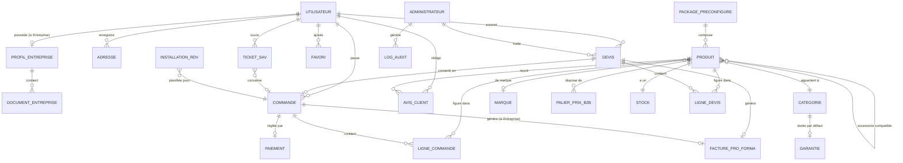

# CAHIER DES DONNÉES

## Plateforme E-commerce B2B/B2C — Électronique & Énergie Solaire (ATC — Alpha Tech Center)

---

### Page de garde

| | |
|---|---|
| **Projet** | Plateforme e-commerce Électronique, Énergie Solaire, Sécurité & Climatisation |
| **Client** | ATC (Alpha Tech Center) |
| **Type de document** | Cahier des Données (Document 9/15) |
| **Version** | 1.1 |
| **Date** | 01/08/2026 |
| **Statut** | Version finale — validée, toutes les questions résolues |
| **Documents parents** | Besoins Fonctionnels (Doc. 3/15), Règles Métiers (Doc. 4/15), Spécifications Détaillées (Doc. 6/15), Architecture Logicielle (Doc. 8/15) |
| **Diffusion** | Direction, Produit, Développement, QA, DevOps |
| **Confidentialité** | Document interne — usage projet uniquement |

---

### Historique des versions

| Version | Date | Auteur | Description |
|---|---|---|---|
| 0.1 | 01/08/2026 | Architecte Logiciel (IA) | Modélisation initiale des entités et relations |
| 1.0 | 01/08/2026 | Architecte Logiciel (IA) | Version finale après auto-évaluation et intégration des améliorations |
| 1.1 | 01/08/2026 | Architecte Logiciel (IA) | Conservation indéfinie des documents Entreprise (décision n°36) et des comptes inactifs (décision n°37) ; H1/H2 confirmées (décisions n°29, n°30) |

---

### Sommaire

1. Introduction et objectifs
2. Méthodologie et conventions
3. Modèle de données conceptuel (diagramme global)
4. Dictionnaire des entités principales
5. Référentiels et énumérations
6. Règles d'intégrité et contraintes
7. Cycle de vie des données sensibles et conservation
8. Volumétrie indicative
9. Risques
10. Hypothèses
11. Décisions actées
12. Questions restantes
13. Traçabilité et documents liés
14. Conclusion

<!-- pagebreak -->

## 1. Introduction et objectifs

Ce cahier modélise les données manipulées par la plateforme, en traduisant les règles de gestion du Cahier 4 en structures concrètes (entités, champs, types, contraintes, relations). Il constitue la référence directe pour la conception du schéma de base de données (PostgreSQL — Cahier d'Architecture, section 6).

## 2. Méthodologie et conventions

- Les entités sont nommées en majuscules (ex. `PRODUIT`), les champs en minuscules avec underscore (ex. `stock_reference`).
- Chaque entité est décrite par : nom du champ, type, contraintes, description.
- Les identifiants primaires sont des identifiants uniques générés par le système (non exposés directement dans les URL pour les entités sensibles, ex. dossiers Entreprise).
- Les statuts (énumérations) sont listés séparément en section 5 pour éviter la duplication.

## 3. Modèle de données conceptuel

<!-- pagebreak -->

## 4. Dictionnaire des entités principales

### UTILISATEUR

| Champ | Type | Contraintes | Description |
|---|---|---|---|
| id | UUID | Clé primaire | Identifiant unique |
| type_compte | Énum | `particulier` \| `entreprise` | Décision actée n°17 (typologie de compte) |
| email | Texte | Unique, obligatoire, format validé | Identifiant de connexion |
| mot_de_passe_hash | Texte | Obligatoire | Haché (Argon2/bcrypt — Cahier 8, section 7) |
| nom | Texte | Obligatoire | Nom du client (Particulier) ou du représentant (Entreprise) |
| telephone | Texte | Optionnel | |
| langue_preferee | Énum | `fr` \| `en` \| `es`, défaut `fr` | RG-14-001 |
| date_creation | Date/heure | Obligatoire, auto | |
| statut_compte | Énum | `actif` \| `suspendu` | |

### PROFIL_ENTREPRISE

| Champ | Type | Contraintes | Description |
|---|---|---|---|
| id | UUID | Clé primaire | |
| utilisateur_id | UUID | Clé étrangère, unique | Lien 1-1 avec UTILISATEUR |
| nom_legal | Texte | Obligatoire | RG-08-001, étape 1 |
| nom_commercial | Texte | Optionnel | |
| nif | Texte | Obligatoire | Numéro d'Identification Fiscale |
| registre_commerce | Texte | Optionnel | |
| adresse_entreprise | Texte | Obligatoire | |
| telephone_professionnel | Texte | Obligatoire | |
| email_professionnel | Texte | Obligatoire, format validé | Vérifié en cohérence à l'étape 3 (RG-08-001) |
| representant_nom | Texte | Obligatoire | |
| representant_fonction | Texte | Obligatoire | |
| secteur_activite | Texte | Obligatoire | |
| taille_entreprise | Texte | Optionnel | |
| statut_validation | Énum | Voir section 5 | Pilote l'accès aux barèmes B2B (RG-03-001) |
| date_soumission | Date/heure | Auto | |
| date_validation | Date/heure | Nullable | Renseignée à l'activation |
| commentaire_admin | Texte | Optionnel | Motif de rejet ou de demande de complément |

### DOCUMENT_ENTREPRISE

| Champ | Type | Contraintes | Description |
|---|---|---|---|
| id | UUID | Clé primaire | |
| profil_entreprise_id | UUID | Clé étrangère | |
| type_document | Énum | `patente` \| `nif` \| `registre_commerce` \| `piece_identite` | |
| fichier_url | Texte | Obligatoire | Référence au stockage objet chiffré (Cahier 8) |
| date_televersement | Date/heure | Auto | |

### PRODUIT

| Champ | Type | Contraintes | Description |
|---|---|---|---|
| id | UUID | Clé primaire | |
| nom | Texte | Obligatoire | |
| description | Texte long | Obligatoire | |
| categorie_id | UUID | Clé étrangère | |
| marque_id | UUID | Clé étrangère, nullable | |
| prix_public | Décimal | Obligatoire, > 0, en USD | RG-03-001 |
| eligible_b2b | Booléen | Défaut faux | Détermine l'affichage du barème (RG-03-004) |
| eligible_package | Booléen | Défaut faux | Détermine le bouton « Ajouter au package » (BF-03-004) |
| statut_publication | Énum | `publié` \| `brouillon` | |

### STOCK

| Champ | Type | Contraintes | Description |
|---|---|---|---|
| produit_id | UUID | Clé primaire, clé étrangère | Relation 1-1 avec PRODUIT |
| stock_actuel | Entier | ≥ 0 | |
| stock_reference | Entier | > 0, défaut **100** | Décision actée n°28 ; base du calcul de pourcentage (RG-03-002) |

*Le pourcentage d'alerte n'est pas stocké : il est calculé dynamiquement (`stock_actuel / stock_reference × 100`) pour éviter toute désynchronisation.*

### PALIER_PRIX_B2B

| Champ | Type | Contraintes | Description |
|---|---|---|---|
| id | UUID | Clé primaire | |
| produit_id | UUID | Clé étrangère | |
| quantite_min | Entier | > 0 | |
| quantite_max | Entier | Nullable (illimité si vide) | |
| prix_unitaire | Décimal | > 0, en USD | RG-03-004 |

*Contrainte d'intégrité : pour un même produit, aucune plage `[quantite_min, quantite_max]` ne doit chevaucher une autre plage existante (voir section 6).*

### DEVIS

| Champ | Type | Contraintes | Description |
|---|---|---|---|
| id | UUID | Clé primaire | |
| utilisateur_id | UUID | Clé étrangère | |
| type_origine | Énum | `package_preconfigure` \| `configurateur_personnalise` | |
| statut | Énum | Voir section 5 | RG-04-001 |
| prix_total | Décimal | Nullable jusqu'à réponse | Calculé via RG-04-003 |
| cout_installation | Décimal | Nullable | Ajouté par l'administrateur (RG-09-002) |
| date_creation | Date/heure | Auto | Déclenche RG-04-002 |
| date_reponse | Date/heure | Nullable | Point de départ du délai d'expiration (RG-04-005) |
| date_expiration_prevue | Date/heure | Calculée = date_reponse + 3 jours | RG-04-005 |
| administrateur_id | UUID | Clé étrangère, nullable | Administrateur ayant traité le devis |

### LIGNE_DEVIS

| Champ | Type | Contraintes | Description |
|---|---|---|---|
| id | UUID | Clé primaire | |
| devis_id | UUID | Clé étrangère | |
| produit_id | UUID | Clé étrangère | |
| quantite | Entier | > 0 | |
| prix_unitaire_applique | Décimal | > 0 | Figé au palier applicable au moment de la réponse |

### COMMANDE

| Champ | Type | Contraintes | Description |
|---|---|---|---|
| id | UUID | Clé primaire | |
| utilisateur_id | UUID | Clé étrangère | |
| devis_id | UUID | Clé étrangère, nullable | Renseigné si issue d'un devis converti (RG-04-004) |
| montant_total | Décimal | > 0, en USD | |
| statut | Énum | Voir section 5 | RG-05-001 |
| date_creation | Date/heure | Auto | |
| date_pret_retrait | Date/heure | Nullable | |
| date_retrait | Date/heure | Nullable | |

### PAIEMENT

| Champ | Type | Contraintes | Description |
|---|---|---|---|
| id | UUID | Clé primaire | |
| commande_id | UUID | Clé étrangère | |
| methode | Énum | `moncash` \| `carte` \| `paypal` | RG-06-001 |
| montant_usd | Décimal | > 0 | |
| montant_htg | Décimal | Nullable, renseigné si `moncash` | |
| taux_change_applique | Décimal | Nullable, renseigné si `moncash` | Journalisé pour traçabilité (RG-06-003/004) |
| statut_transaction | Énum | `réussie` \| `échouée` \| `en cours` | |
| date_transaction | Date/heure | Auto | |

### FACTURE_PRO_FORMA

| Champ | Type | Contraintes | Description |
|---|---|---|---|
| id | UUID | Clé primaire | |
| numero_sequentiel | Texte | Unique, auto-incrémenté | RG-06-002 |
| commande_id | UUID | Clé étrangère, nullable | |
| devis_id | UUID | Clé étrangère, nullable | |
| montant_ht | Décimal | > 0 | |
| taux_taxe | Décimal | Défaut **10 %** | Décision actée n°18 |
| montant_taxe | Décimal | Calculé | |
| montant_ttc | Décimal | Calculé | |
| date_generation | Date/heure | Auto | |

### GARANTIE (référentiel)

| Champ | Type | Contraintes | Description |
|---|---|---|---|
| categorie_id | UUID | Clé primaire, clé étrangère | |
| duree_mois | Entier | > 0 | Valeurs de travail validées (décision actée n°19) : Électronique 12, Solaire 24, Sécurité 12, Climatisation 12 |

### ADMINISTRATEUR

| Champ | Type | Contraintes | Description |
|---|---|---|---|
| id | UUID | Clé primaire | |
| email | Texte | Unique | |
| role | Énum | `general` \| `agent_sav` | Décision actée n°20, exactement 2 valeurs possibles |

### PARAMETRES_GENERAUX

| Champ | Type | Contraintes | Description |
|---|---|---|---|
| id | UUID | Clé primaire (singleton) | Une seule ligne en base |
| taux_change_htg_usd | Décimal | > 0 | Défini manuellement par l'administrateur (RG-06-003) |
| langues_actives | Liste | Sous-ensemble de `{fr, en, es}` | |
| date_derniere_maj_taux | Date/heure | Auto | Traçabilité des mises à jour du taux |

## 5. Référentiels et énumérations

| Énumération | Valeurs | Référence |
|---|---|---|
| `statut_validation` (Entreprise) | `en_attente` · `valide` (« B2B vérifié ») · `rejete` · `complement_demande` | RG-08-001 |
| `statut_devis` | `en_attente` · `repondu` · `accepte` · `refuse` · `expire` · `converti` | RG-04-001 |
| `statut_commande` | `en_preparation` · `prete_retrait` · `retiree` | RG-05-001 |
| `type_document` | `patente` · `nif` · `registre_commerce` · `piece_identite` | RG-08-001 |
| `role_admin` | `general` · `agent_sav` | RG-12-001 |
| `methode_paiement` | `moncash` · `carte` · `paypal` | RG-06-001 |
| `niveau_alerte_stock` | *(calculé, non stocké)* `en_stock` · `alerte_orange` · `alerte_rouge` · `rupture` | RG-03-002 |

## 6. Règles d'intégrité et contraintes

| Contrainte | Entité(s) | Règle source |
|---|---|---|
| Non-chevauchement des plages de quantité pour un même produit | PALIER_PRIX_B2B | RG-03-004, UC-12-001 (E1) |
| `stock_actuel` ne peut pas être négatif | STOCK | RG-03-002 |
| Un DEVIS ne peut passer à `accepte` que depuis le statut `repondu`, et uniquement avant `date_expiration_prevue` | DEVIS | RG-04-001, RG-04-005 |
| Une COMMANDE avec `devis_id` renseigné hérite du prix figé du devis (non recalculable) | COMMANDE, LIGNE_DEVIS | RG-04-004 |
| `taux_change_applique` doit être copié dans PAIEMENT au moment de la transaction (jamais recalculé a posteriori) | PAIEMENT | RG-06-003/004, Cahier 8 section 7 |
| Un PROFIL_ENTREPRISE ne peut accéder aux PALIER_PRIX_B2B qu'au statut `valide` | PROFIL_ENTREPRISE | RG-08-001, RG-03-001 |
| `role_admin` limité strictement à 2 valeurs (pas d'ajout libre de rôle) | ADMINISTRATEUR | Décision actée n°20 |

## 7. Cycle de vie des données sensibles et conservation

- **Documents Entreprise** (patente, NIF, pièce d'identité) : stockage chiffré, accès restreint aux administrateurs habilités ; **conservation à durée indéfinie, sans suppression automatique programmée** (décision actée n°36). Ce choix reste soumis au droit d'accès et de suppression individuel du client, garanti par la politique de confidentialité multi-juridictions (décision actée n°2 ; voir aussi le risque associé en section 9).
- **Données de paiement** : aucune donnée de carte bancaire n'est stockée par la plateforme (déléguée aux passerelles PSP/PayPal) ; seules les métadonnées de transaction (montant, statut, taux) sont conservées.
- **Comptes inactifs** : **aucune politique de suppression ou d'anonymisation** (décision actée n°37) — les comptes sont conservés indéfiniment, quelle que soit leur durée d'inactivité, sauf demande explicite du client.

## 8. Volumétrie indicative

Sur la base de la décision actée n°12 (~50 transactions/jour, commandes et devis confondus) :

| Donnée | Estimation annuelle indicative |
|---|---|
| Devis + commandes | ~18 000 / an |
| Lignes de devis/commande (moyenne 3 produits par transaction) | ~54 000 / an |
| Documents Entreprise téléversés (hypothèse : ~200 nouveaux comptes Entreprise/an × 4 documents) | ~800 / an |
| Factures pro forma | Sous-ensemble des commandes/devis B2B |

*Ces ordres de grandeur confirment que le dimensionnement initial proposé au Cahier d'Architecture (section 9) est cohérent et n'impose aucune contrainte de volumétrie particulière sur le choix de PostgreSQL.*

## 9. Risques

| Risque | Impact | Niveau |
|---|---|---|
| Conservation indéfinie des documents Entreprise (décision actée n°36) sans purge automatique | Volume de données sensibles croissant sans limite ; dépendance accrue au droit de suppression individuel pour rester conforme | Moyen |
| Absence de politique de suppression des comptes inactifs (décision actée n°37) | Accumulation de comptes et de données au fil des années | Faible à moyen |
| Contrainte de non-chevauchement des paliers de prix complexe à valider en base (logique applicative nécessaire, pas uniquement une contrainte SQL simple) | Risque de bug si mal implémentée | Moyen |

## 10. Hypothèses

Aucune hypothèse propre à ce cahier ne subsiste : le stock de référence par défaut (décision n°28), la conservation des documents Entreprise (décision n°36) et la politique de suppression des comptes inactifs (décision n°37) sont désormais actés. Les hypothèses H1 à H3 du Cahier UX/UI sont également toutes confirmées (décisions n°29 à 31).

## 11. Décisions actées

Reprises à l'identique du Cahier des Règles Métiers, sans modification. Voir Cahier 4 pour la table complète des 39 décisions.

## 12. Questions restantes

Les quatre questions initialement ouvertes dans ce cahier sont désormais résolues :
1. ~~Durée de conservation des documents Entreprise~~ — **Résolu** : conservation à durée indéfinie (décision actée n°36).
2. ~~Politique de suppression/anonymisation des comptes inactifs~~ — **Résolu** : aucune politique de suppression, conservation indéfinie (décision actée n°37).
3. ~~Règle de cohérence minimale du configurateur~~ — **Résolu** : au moins un panneau et une batterie, contrainte confirmée (décision actée n°29).
4. ~~Formats et taille maximale des documents `DOCUMENT_ENTREPRISE`~~ — **Résolu** : PDF/JPG/PNG, 5 Mo maximum (décision actée n°30).

## 13. Traçabilité et documents liés

Ce modèle de données sera directement reprise :

- Dans le **Cahier des Intégrations (Cahier 10)**, pour le mapping des champs échangés avec MonCash, le PSP carte, PayPal et WhatsApp.
- Dans le **Cahier des Exigences Non Fonctionnelles (Cahier 11)**, pour les exigences de sauvegarde, chiffrement et durée de conservation.
- Dans le **Cahier des Tests (Cahier 12)**, pour les tests de contraintes d'intégrité (ex. chevauchement de paliers, transitions de statut interdites).

## 14. Conclusion

Ce cahier modélise **17 entités principales**, leurs relations, et 7 règles d'intégrité critiques directement dérivées des règles de gestion du Cahier 4. La volumétrie indicative confirme que le choix d'une base de données relationnelle unique (Cahier 8) est largement suffisant au regard de la cible de 50 transactions/jour.

Les quatre questions initialement ouvertes sont désormais résolues ; seule la réception des fichiers de marque ATC (Q2, Cahier UX/UI) reste en attente à l'échelle du projet, sans impact sur ce cahier. La rédaction peut se poursuivre avec le **Cahier des Intégrations (Cahier 10)**.

---

*Fin du Cahier des Données — Document 9/15*
