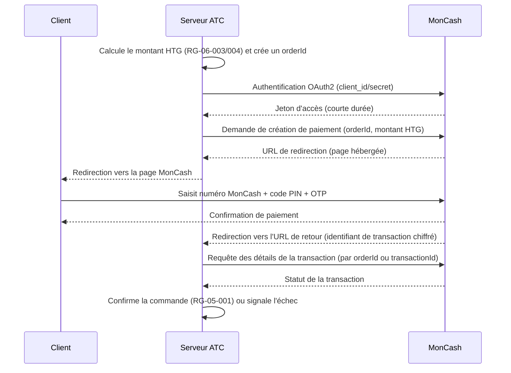

# CAHIER DES INTÉGRATIONS

## Plateforme E-commerce B2B/B2C — Électronique & Énergie Solaire (ATC — Alpha Tech Center)

---

### Page de garde

| | |
|---|---|
| **Projet** | Plateforme e-commerce Électronique, Énergie Solaire, Sécurité & Climatisation |
| **Client** | ATC (Alpha Tech Center) |
| **Type de document** | Cahier des Intégrations (Document 10/15) |
| **Version** | 1.1 |
| **Date** | 01/08/2026 |
| **Statut** | Version finale — validée, PSP et WhatsApp résolus |
| **Documents parents** | Règles Métiers (Doc. 4/15), Architecture Logicielle (Doc. 8/15), Données (Doc. 9/15) |
| **Diffusion** | Direction, Produit, Développement, QA, DevOps |
| **Confidentialité** | Document interne — usage projet uniquement |

---

### Historique des versions

| Version | Date | Auteur | Description |
|---|---|---|---|
| 0.1 | 01/08/2026 | Architecte Logiciel (IA) | Rédaction initiale des intégrations techniques |
| 1.0 | 01/08/2026 | Architecte Logiciel (IA) | Version finale après auto-évaluation et intégration des améliorations |
| 1.1 | 01/08/2026 | Architecte Logiciel (IA) | PSP carte laissé libre au prestataire de développement (décision n°34) ; WhatsApp intégré directement via Meta (décision n°38) |

---

### Sommaire

1. Introduction et périmètre
2. Méthodologie et légende
3. Intégration MonCash
4. Intégration passerelle carte (Visa/Mastercard)
5. Intégration PayPal
6. Intégration WhatsApp Business (notifications et assistance)
7. Gestion des erreurs et résilience (transverse)
8. Sécurité des intégrations
9. Environnements de test
10. Risques
11. Hypothèses
12. Décisions actées
13. Questions restantes
14. Traçabilité et documents liés
15. Conclusion

<!-- pagebreak -->

## 1. Introduction et périmètre

Ce cahier détaille les intégrations techniques externes identifiées au Cahier d'Architecture (Cahier 8, section 8) : MonCash, une passerelle de paiement carte, PayPal, et WhatsApp Business. Aucune intégration transporteur/logistique n'est nécessaire, conformément à la décision actée n°27 (aucun service de livraison).

**Note méthodologique :** les informations techniques relatives à MonCash présentées ci-dessous s'appuient sur la documentation publique de l'API REST MonCash (Digicel). Le choix du prestataire de paiement carte n'étant pas encore arbitré par ATC (question ouverte Q3), ce cahier décrit un **modèle d'intégration indépendant du prestataire**, complété de quelques pistes réelles identifiées à titre indicatif.

## 2. Méthodologie et légende

**Convention d'identifiant :** `INT-[Service]-[N° séquentiel]`, ex. `INT-MC-002`.
Chaque intégration est décrite par : objectif, mode d'authentification, flux d'échange, données transmises, gestion des erreurs, environnement de test, et références aux règles de gestion (Cahier 4).

<!-- pagebreak -->

## 3. Intégration MonCash

**INT-MC-001 — Authentification**
MonCash expose une API REST authentifiée par jeton **OAuth 2.0** (grant `client_credentials`). Le serveur ATC s'authentifie auprès du point de terminaison d'autorisation avec le `client_id` et le `client_secret` obtenus depuis le portail marchand MonCash, et reçoit un jeton d'accès (bearer token) à **durée de vie très courte (de l'ordre d'une minute)**. Ce jeton doit être redemandé à chaque opération plutôt que mis en cache sur une longue durée — point d'attention important pour l'équipe de développement.

**INT-MC-002 — Création du paiement (flux recommandé pour la V1)**
Mode retenu : **paiement hébergé par redirection** (« Bouton MonCash »), plus simple à intégrer et à sécuriser qu'une intégration API directe pour une première version.

**Données transmises :** identifiant de commande (`orderId`), montant en HTG. Aucune donnée bancaire n'est manipulée directement par le serveur ATC.
**Données reçues en retour :** identifiant de transaction, statut (réussie/échouée).
**Gestion des erreurs :** en cas d'échec ou d'absence de confirmation après redirection, le serveur ATC interroge activement l'API de détails de transaction avant d'afficher un message d'échec au client (éviter les faux négatifs dus à une redirection interrompue).
**Environnement de test :** portail sandbox dédié de Digicel MonCash, nécessitant la création d'un compte marchand de test et la configuration des URL de retour et d'alerte.
**Règles métier associées :** RG-06-001, RG-06-003, RG-06-004.

## 4. Intégration passerelle carte (Visa/Mastercard)

**Modèle d'intégration recommandé (indépendant du prestataire retenu) :**
- Paiement par **page hébergée ou tokenisation côté client** : les données de carte ne transitent jamais en clair par le serveur ATC, ce qui réduit le périmètre de conformité PCI DSS à l'auto-évaluation la plus légère (SAQ A).
- Flux : création d'une session de paiement côté serveur ATC → redirection ou widget hébergé par le prestataire → confirmation via webhook ou requête de statut, selon le même schéma que l'intégration MonCash (section 3).

**Pistes de prestataires identifiées (à évaluer par l'équipe technique — décision actée n°34) :** ATC a confirmé laisser ce choix libre, sans préférence. Plusieurs solutions desservent explicitement des marchands basés en Haïti — parmi celles identifiées : 2Checkout/Verifone, IBEX PAY, Plisi, ainsi que des acteurs fintech locaux comme HaitiPay. Un grand nombre de passerelles internationales généralistes (ex. Stripe) ne sont pas nécessairement accessibles à une entreprise domiciliée en Haïti, ce qui justifie de privilégier des prestataires ayant une couverture confirmée de la région. **Recommandation :** le prestataire déjà identifié par ATC pour le développement (décision actée n°35) est le mieux placé pour arbitrer ce choix technique final, sur la base des critères de frais, délai d'intégration et éligibilité KYC.
**Règles métier associées :** RG-06-001, RG-06-004.

## 5. Intégration PayPal

**Authentification :** OAuth 2.0 (`client_credentials`), jeton à durée de vie standard (plusieurs heures), renouvelable.
**Flux :** création d'une commande via l'API Orders (montant en USD) → redirection ou intégration embarquée pour approbation par le client → capture du paiement côté serveur ATC après confirmation.
**Données transmises :** référence de commande, montant en USD.
**Gestion des erreurs :** capture différée avec nouvelle tentative automatique limitée en cas d'erreur transitoire ; au-delà, retour explicite au client avec proposition d'un autre moyen de paiement.
**Environnement de test :** environnement sandbox PayPal Developer, comptes acheteur/vendeur de test.
**Règles métier associées :** RG-06-001.

## 6. Intégration WhatsApp Business (notifications et assistance)

**Objectif :** notifications automatiques (statut de devis, commande prête pour retrait) et canal d'assistance client (BF-09-003).
**Mode d'intégration (confirmé — décision actée n°38) :** intégration **directe avec la plateforme Meta** (WhatsApp Business Platform / Cloud API), sans fournisseur tiers (BSP). ATC devra disposer d'un compte WhatsApp Business vérifié auprès de Meta ; l'équipe de développement (décision actée n°35) prendra en charge la configuration de ce compte si elle n'existe pas encore.
**Flux :** le module Notifications (Cahier 8, section 5) déclenche l'envoi d'un message structuré (modèle pré-approuvé par Meta, ex. « Votre devis a été répondu ») via l'API Cloud de Meta, authentifiée par jeton d'accès applicatif propre à ATC.
**Assistance client (chatbot) :** premier niveau de réponse automatisé (FAQ, statut de commande), avec bascule vers un agent SAV pour les demandes complexes (RG-12 — modération/traitement humain).
**Point d'attention :** l'intégration directe avec Meta implique un délai de vérification du compte professionnel (processus de vérification d'entreprise Meta) à anticiper suffisamment tôt dans le calendrier de développement, contrairement à un fournisseur tiers qui aurait pu accélérer cette étape.
**Règles métier associées :** BF-09-003.

<!-- pagebreak -->

## 7. Gestion des erreurs et résilience (transverse)

| Situation | Comportement attendu |
|---|---|
| Timeout ou indisponibilité temporaire d'un prestataire de paiement | Nouvelle tentative automatique limitée (ex. 2 essais), puis message clair invitant à réessayer ou changer de moyen de paiement |
| Redirection interrompue (client ferme la page pendant le paiement MonCash/carte) | Le serveur ATC interroge activement le statut de la transaction avant de considérer le paiement comme abandonné |
| Échec d'envoi d'une notification WhatsApp | Repli automatique sur notification email, sans bloquer le processus métier associé (RG-04, RG-05) |
| Incohérence de montant entre la demande et la confirmation reçue | Transaction rejetée par défaut, alerte à l'administrateur (jamais de validation automatique en cas d'écart) |

## 8. Sécurité des intégrations

- Toutes les clés et secrets (`client_id`/`client_secret` MonCash, PayPal, PSP carte, jetons WhatsApp) sont stockés chiffrés, jamais dans le code source (cohérent avec Cahier 8, section 7).
- Aucune donnée de carte bancaire n'est stockée par la plateforme ATC (déléguée aux prestataires — modèle SAQ A, section 4).
- Les webhooks/URL de retour sont protégés par vérification de signature ou de jeton, pour empêcher toute confirmation de paiement falsifiée.
- Le montant final confirmé provient toujours du prestataire (MonCash, PSP, PayPal), jamais recalculé unilatéralement côté client.

## 9. Environnements de test

Chaque intégration dispose d'un environnement sandbox distinct (MonCash, PSP carte à sélectionner par le prestataire de développement, PayPal Developer, Meta WhatsApp Business), à configurer dès le début du développement pour permettre des tests de bout en bout sans transactions réelles.

## 10. Risques

| Risque | Impact | Niveau |
|---|---|---|
| Jeton MonCash à très courte durée de vie mal géré (mise en cache excessive) | Échecs de paiement intermittents | Moyen |
| Choix du PSP carte laissé au prestataire de développement, sans validation préalable par ATC | Risque de choix non aligné avec les attentes commerciales d'ATC si aucun point de contrôle n'est prévu | Faible à moyen |
| Délai de vérification du compte WhatsApp Business Meta (intégration directe — décision n°38) | Retard sur la mise en service du canal WhatsApp si non anticipé | Moyen |
| Éligibilité incertaine de certains prestataires internationaux pour une entreprise domiciliée en Haïti | Risque de blocage tardif si le prestataire choisi s'avère finalement inéligible | Moyen |

## 11. Hypothèses

- Le modèle d'intégration carte (page hébergée/tokenisation) est retenu indépendamment du prestataire final, pour limiter l'impact d'un changement ultérieur de PSP.
- Les hypothèses H1 à H3 du Cahier UX/UI sont désormais confirmées (décisions actées n°29 à 31) ; sans impact sur ce cahier.

## 12. Décisions actées

Reprises à l'identique du Cahier des Règles Métiers, sans modification. Voir Cahier 4 pour la table complète des 39 décisions.

## 13. Questions restantes

Les deux questions initialement ouvertes dans ce cahier sont désormais résolues :
1. ~~Choix du prestataire de paiement carte~~ — **Résolu** : laissé libre à l'équipe technique du prestataire de développement (décision actée n°34), parmi les pistes identifiées ou toute autre option pertinente.
2. ~~Préférence pour l'intégration WhatsApp~~ — **Résolu** : intégration directe avec Meta (décision actée n°38).

Seule la réception des fichiers de marque ATC (Q2, Cahier UX/UI) reste en attente, sans impact sur ce cahier.

## 14. Traçabilité et documents liés

Ces intégrations seront directement reprises :

- Dans le **Cahier des Exigences Non Fonctionnelles (Cahier 11)**, pour les exigences de disponibilité et de temps de réponse des services externes.
- Dans le **Cahier des Tests (Cahier 12)**, pour les scénarios de test en environnement sandbox, y compris les cas d'erreur (section 7).

## 15. Conclusion

Ce cahier détaille les quatre intégrations externes du projet, en s'appuyant sur la documentation réelle de l'API MonCash plutôt que sur des suppositions techniques. Les deux questions initialement ouvertes (choix du PSP carte, intégration WhatsApp) sont désormais résolues par ATC : le choix du PSP est laissé au prestataire de développement, et WhatsApp sera intégré directement via Meta.

La rédaction peut se poursuivre avec le **Cahier des Exigences Non Fonctionnelles (Cahier 11)**.

---

*Fin du Cahier des Intégrations — Document 10/15*
