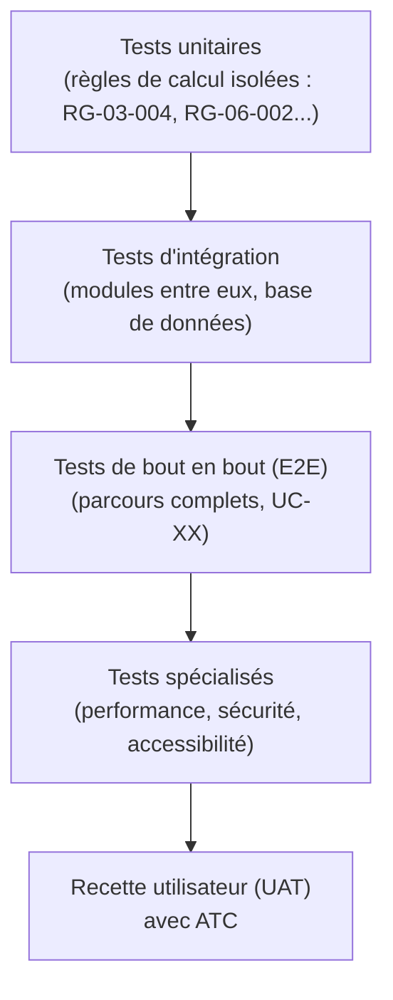

# CAHIER DES TESTS

## Plateforme E-commerce B2B/B2C — Électronique & Énergie Solaire (ATC — Alpha Tech Center)

---

### Page de garde

| | |
|---|---|
| **Projet** | Plateforme e-commerce Électronique, Énergie Solaire, Sécurité & Climatisation |
| **Client** | ATC (Alpha Tech Center) |
| **Type de document** | Cahier des Tests (Document 12/15) |
| **Version** | 1.1 |
| **Date** | 01/08/2026 |
| **Statut** | Version finale — validée, H4/H5 confirmées |
| **Documents parents** | Besoins Fonctionnels (Doc. 3/15), Règles Métiers (Doc. 4/15), Cas d'Utilisation (Doc. 5/15), Exigences Non Fonctionnelles (Doc. 11/15) |
| **Diffusion** | Direction, Produit, Développement, QA |
| **Confidentialité** | Document interne — usage projet uniquement |

---

### Historique des versions

| Version | Date | Auteur | Description |
|---|---|---|---|
| 0.1 | 01/08/2026 | Lead QA (IA) | Rédaction initiale de la stratégie et des cas de test critiques |
| 1.0 | 01/08/2026 | Lead QA (IA) | Version finale après auto-évaluation et intégration des améliorations |
| 1.1 | 01/08/2026 | Lead QA (IA) | Règle d'égalité J+3 et arrondi de taxe confirmés (décisions n°32, n°33) |

---

### Sommaire

1. Introduction et objectifs
2. Stratégie de test
3. Niveaux et types de tests
4. Cas de test critiques (cas limites et règles de gestion)
5. Tests de performance et de charge
6. Tests de sécurité
7. Tests d'accessibilité
8. Tests des intégrations externes
9. Gestion des anomalies
10. Recette utilisateur (UAT)
11. Outils et automatisation
12. Critères de sortie
13. Risques
14. Hypothèses
15. Décisions actées
16. Questions restantes
17. Traçabilité et documents liés
18. Conclusion

<!-- pagebreak -->

## 1. Introduction et objectifs

Ce cahier définit la stratégie de test de la plateforme et détaille les cas de test critiques, en particulier ceux couvrant les **cas limites des règles de gestion** (Cahier 4) déjà identifiés comme sensibles au fil des cahiers précédents (chevauchement de paliers de prix, expiration de devis à J+3, seuils d'alerte de stock à 40 %/15 %). Il s'appuie directement sur les cas d'utilisation du Cahier 5 (scénarios nominaux, alternatifs, d'erreur) et les cibles chiffrées du Cahier 11.

## 2. Stratégie de test

La stratégie suit une pyramide de test classique, adaptée à l'architecture en monolithe modulaire retenue (Cahier 8) :

**Principe directeur :** les règles de gestion à logique de calcul (barème B2B, conversion MonCash, taxe, statuts) sont couvertes en priorité par des tests unitaires exhaustifs sur les cas limites, avant même les tests de bout en bout — car ce sont les erreurs les plus coûteuses si elles atteignent la production (impact financier direct).

## 3. Niveaux et types de tests

| Niveau | Objectif | Cible de couverture |
|---|---|---|
| Unitaire | Valider isolément chaque règle de gestion (RG-XX) | ≥ 70 % sur les modules critiques (NFR-10, Cahier 11) |
| Intégration | Valider les échanges entre modules et avec la base de données | Tous les flux inter-modules du Cahier 8, section 5 |
| Bout en bout (E2E) | Valider chaque cas d'utilisation majeur (Cahier 5) | 100 % des UC « Must have » |
| Performance/charge | Valider les cibles du Cahier 11 (section 2-3) | Scénarios de pic (2× la volumétrie nominale) |
| Sécurité | Valider l'absence de vulnérabilités courantes | Avant chaque mise en production majeure |
| Accessibilité | Valider la conformité WCAG 2.2 AA | Parcours Must have (Cahier UX/UI, section 8) |
| Non-régression | Éviter la réapparition d'anomalies corrigées | Suite automatisée exécutée à chaque déploiement (CI/CD, Cahier 8 section 12) |

<!-- pagebreak -->

## 4. Cas de test critiques (cas limites et règles de gestion)

### TC-03-001 — Seuils d'alerte de stock (RG-03-002)

| ID | Scénario | Donnée d'entrée | Résultat attendu |
|---|---|---|---|
| TC-03-001-a | Juste au-dessus du seuil orange | Stock 41 % du stock de référence | Statut « En stock », aucune alerte |
| TC-03-001-b | Exactement au seuil orange | Stock 40 % du stock de référence | Statut « Alerte orange » |
| TC-03-001-c | Juste en dessous du seuil orange | Stock 39 % | Statut « Alerte orange » |
| TC-03-001-d | Exactement au seuil rouge | Stock 15 % | Statut « Alerte rouge » |
| TC-03-001-e | Juste en dessous du seuil rouge | Stock 14 % | Statut « Alerte rouge » |
| TC-03-001-f | Stock nul | Stock 0 % | Statut « Rupture », achat direct désactivé, package personnalisé toujours accessible |

### TC-03-002 — Barème de prix B2B par palier (RG-03-004)

| ID | Scénario | Résultat attendu |
|---|---|---|
| TC-03-002-a | Quantité en début de palier | Prix unitaire du palier correspondant appliqué |
| TC-03-002-b | Quantité en fin de palier | Prix unitaire du palier correspondant appliqué (pas de bascule prématurée) |
| TC-03-002-c | Quantité juste au-dessus de la borne d'un palier | Bascule correcte vers le palier suivant |
| TC-03-002-d | Tentative de création de deux paliers avec chevauchement (ex. 1-10 et 5-20) | Rejet à l'enregistrement côté back-office (UC-12-001, E1) |
| TC-03-002-e | Client Entreprise non « B2B vérifié » | Prix public affiché, barème non visible (RG-08-001) |

### TC-04-001 — Cycle de vie et expiration d'un devis (RG-04-001, RG-04-005)

| ID | Scénario | Résultat attendu |
|---|---|---|
| TC-04-001-a | Acceptation à J+2 (dans le délai) | Devis accepté avec succès, conversion en commande possible |
| TC-04-001-b | Acceptation exactement à J+3 | Devis accepté avec succès (décision actée n°32 : encore valide à l'instant J+3 exact) |
| TC-04-001-c | Tentative d'acceptation après J+3 | Refus, message d'expiration, invitation à demander un nouveau devis |
| TC-04-001-d | Tentative de transition directe « En attente » → « Accepté » (sans passer par « Répondu ») | Transition refusée par le système |

### TC-06-001 — Conversion MonCash et taxe (RG-06-002, RG-06-003, RG-06-004)

| ID | Scénario | Résultat attendu |
|---|---|---|
| TC-06-001-a | Affichage du montant HTG avant confirmation | Montant identique à celui effectivement débité (pas de recalcul après confirmation) |
| TC-06-001-b | Modification du taux de change par l'administrateur pendant qu'un client est sur l'écran de paiement | Le taux appliqué est celui en vigueur au moment de la confirmation, journalisé avec la transaction |
| TC-06-001-c | Calcul de la taxe à 10 % sur un montant avec décimales | Arrondi au centime le plus proche, méthode arithmétique standard (décision actée n°33) |
| TC-06-001-d | Tentative de paiement par virement bancaire | Option absente de l'interface (RG-06-001) |

### TC-08-001 — Validation d'un compte Entreprise (RG-08-001)

| ID | Scénario | Résultat attendu |
|---|---|---|
| TC-08-001-a | Dossier complet, approuvé par l'administrateur | Statut « B2B vérifié », accès immédiat aux barèmes |
| TC-08-001-b | Dossier rejeté | Statut « rejeté », accès uniquement aux tarifs publics |
| TC-08-001-c | Demande de complément | Retour à l'étape 2 côté client, statut « en attente » maintenu |
| TC-08-001-d | Tentative d'accès au barème B2B avant validation | Prix public affiché uniquement |

## 5. Tests de performance et de charge

| Test | Référence | Critère de succès |
|---|---|---|
| Temps de premier affichage (LCP) | NFR-01 | < 2,5 s sur connexion 3G simulée |
| Charge nominale | NFR-03 | Absorption de 50 transactions/jour simulées sans dégradation |
| Charge de pic | NFR-03 | Absorption de 500 transactions/jour simulées (10×) avec montée en charge automatique |
| Temps de réponse API catalogue | NFR-01 | < 500 ms au 95ᵉ percentile sous charge nominale |

## 6. Tests de sécurité

- Vérification de l'absence de vulnérabilités courantes (injection, XSS, CSRF) sur tous les formulaires, en particulier le paiement et l'inscription Entreprise.
- Test de non-exposition des données de carte bancaire (aucune donnée sensible ne doit transiter par les journaux applicatifs).
- Test des permissions du rôle Agent SAV : tentative d'accès aux endpoints de gestion des prix et paramètres généraux → doit être refusée (RG-12-001).
- Test d'intrusion complet avant la mise en production initiale (NFR-06).

## 7. Tests d'accessibilité

- Navigation complète au clavier des parcours achat direct, devis, paiement et inscription Entreprise, sans piège au clavier.
- Vérification du contraste sur l'ensemble des composants du design system (Cahier UX/UI, section 2.1).
- Test avec lecteur d'écran sur les badges de stock et étiquettes de statut (doivent porter un texte alternatif, pas seulement une couleur — Cahier UX/UI, section 8).

## 8. Tests des intégrations externes

| Intégration | Scénarios à tester |
|---|---|
| MonCash | Paiement réussi, paiement échoué, redirection interrompue (Cahier 10, section 7) |
| PSP carte | Paiement réussi, paiement refusé par la banque |
| PayPal | Paiement réussi, capture différée avec nouvelle tentative |
| WhatsApp | Envoi de notification réussi, repli sur email en cas d'échec |

*Tous ces tests sont réalisés en environnement sandbox (Cahier 10, section 9), jamais en production.*

## 9. Gestion des anomalies

| Sévérité | Définition | Délai de correction visé |
|---|---|---|
| Bloquante | Empêche un parcours Must have de bout en bout (ex. paiement impossible) | Avant mise en production |
| Majeure | Fonctionnalité dégradée avec contournement possible | Sous 5 jours ouvrés |
| Mineure | Défaut cosmétique ou UX sans impact fonctionnel | Backlog, priorisation ultérieure |

Chaque anomalie référence l'identifiant du cas de test (`TC-XX-NNN`) ou du cas d'utilisation (`UC-XX-NNN`) concerné, pour garantir la traçabilité.

## 10. Recette utilisateur (UAT)

La recette finale avec ATC portera prioritairement sur :
- Le parcours d'achat direct (Particulier) de bout en bout, y compris le retrait.
- Le parcours de devis B2B, du configurateur jusqu'à la facture pro forma.
- La validation d'un compte Entreprise depuis le back-office.
- La gestion du catalogue et des barèmes de prix par un administrateur.

**Critère de validation :** chaque parcours doit être exécuté sans intervention technique par une personne d'ATC n'ayant pas participé au développement, avant acceptation finale.

## 11. Outils et automatisation

Recommandation : suite de tests automatisés intégrée au pipeline CI/CD (Cahier 8, section 12), avec exécution systématique avant chaque déploiement — condition de fiabilité pour une plateforme se voulant scalable et évolutive sans régression.

## 12. Critères de sortie

- [ ] 100 % des cas de test critiques de la section 4 exécutés avec succès.
- [ ] Couverture de tests unitaires ≥ 70 % sur les modules Paiement, Devis, Compte Client (NFR-10).
- [ ] Aucune anomalie bloquante ouverte.
- [ ] Recette utilisateur (section 10) validée par ATC.
- [ ] Test d'intrusion réalisé sans vulnérabilité critique non corrigée.

<!-- pagebreak -->

## 13. Risques

| Risque | Impact | Niveau |
|---|---|---|
| Couverture de test à surveiller avec le prestataire de développement déjà identifié (décision n°35) | Retard possible sur les critères de sortie si non planifié tôt | Faible à moyen |

## 14. Hypothèses

Toutes les hypothèses de ce cahier sont désormais résolues :
- ~~(H4) TC-04-001-b~~ — **Confirmée** (décision actée n°32) : l'acceptation exactement à l'instant J+3 est considérée comme **encore valide** (expiration strictement après J+3).
- ~~(H5) TC-06-001-c~~ — **Confirmée** (décision actée n°33) : arrondi au centime le plus proche (méthode arithmétique standard).

Les hypothèses H1 à H3 du Cahier UX/UI sont également confirmées (décisions n°29 à 31). Plus aucune hypothèse ne subsiste dans ce cahier.

## 15. Décisions actées

Reprises à l'identique du Cahier des Règles Métiers, sans modification. Voir Cahier 4 pour la table complète des 39 décisions.

## 16. Questions restantes

Aucune question bloquante ne subsiste. Les deux précisions initialement en hypothèse (règle d'égalité à J+3, méthode d'arrondi de la taxe) sont désormais actées (décisions n°32 et n°33). Seule la réception des fichiers de marque ATC (Q2, Cahier UX/UI) reste en attente à l'échelle du projet, sans impact sur ce cahier.

## 17. Traçabilité et documents liés

Ce cahier référence systématiquement les `UC-XX-NNN` (Cahier 5), `RG-XX-NNN` (Cahier 4) et `NFR-XX` (Cahier 11) associés à chaque test. Il alimentera directement :

- Le **Dossier Final de Validation (Cahier 15)**, pour la matrice de traçabilité complète (besoins → fonctionnalités → cas d'utilisation → tests).
- Les **Guides Administrateur et Utilisateur (Cahiers 13-14)**, dont les procédures documentées doivent correspondre aux parcours validés en recette.

## 18. Conclusion

Ce cahier établit une stratégie de test en pyramide, avec un accent particulier sur les **cas limites des règles de gestion à impact financier** (barème B2B, conversion de devise, taxe, expiration de devis) — les erreurs les plus coûteuses si elles atteignaient la production. Deux hypothèses mineures (arrondi, égalité à J+3) sont posées pour ne pas bloquer la suite.

La rédaction peut se poursuivre avec le **Guide Administrateur (Cahier 13)**.

---

*Fin du Cahier des Tests — Document 12/15*
