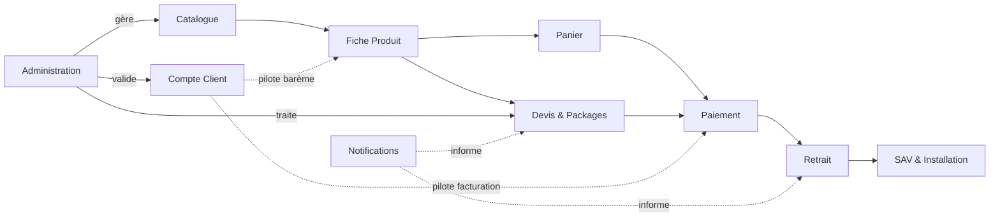

# DOSSIER FINAL DE VALIDATION

## Plateforme E-commerce B2B/B2C — Électronique & Énergie Solaire (ATC — Alpha Tech Center)

---

### Page de garde

| | |
|---|---|
| **Projet** | Plateforme e-commerce Électronique, Énergie Solaire, Sécurité & Climatisation |
| **Client** | ATC (Alpha Tech Center) |
| **Type de document** | Dossier Final de Validation (Document 15/15 — dernier document de la série) |
| **Version** | 1.1 |
| **Date** | 01/08/2026 |
| **Statut** | Version finale — en attente de validation client |
| **Documents parents** | L'ensemble des Cahiers 1 à 14 |
| **Diffusion** | Direction, Produit, UX/UI, Développement, QA, DevOps |
| **Confidentialité** | Document interne — usage projet uniquement |

---

### Historique des versions

| Version | Date | Auteur | Description |
|---|---|---|---|
| 0.1 | 01/08/2026 | Architecte Produit Senior (IA) | Consolidation initiale des 14 cahiers précédents |
| 1.0 | 01/08/2026 | Architecte Produit Senior (IA) | Version finale après auto-évaluation et intégration des améliorations |
| 1.1 | 01/08/2026 | Architecte Produit Senior (IA) | Intégration de la décision n°39 (palette officielle mesurée sur le logo reçu) ; mise à jour des questions restantes suite à la réception de 74 photos (installations, logo, visuels fournisseur) |

---

### Sommaire

1. Introduction et objectif du dossier
2. Synthèse exécutive du projet
3. Décisions d'architecture
4. Matrice de traçabilité
5. Risques globaux consolidés
6. Recommandations d'évolution
7. Roadmap produit
8. Priorités de mise en œuvre
9. KPI consolidés
10. Dépendances entre modules
11. Glossaire complet
12. Annexes
13. Questions restantes
14. Conclusion générale du projet

<!-- pagebreak -->

## 1. Introduction et objectif du dossier

Ce dossier clôt la série de 15 documents produits pour le projet de plateforme e-commerce ATC (Alpha Tech Center). Il ne redéfinit aucune règle ni aucun besoin : il **consolide** les décisions, risques, priorités et indicateurs déjà établis dans les Cahiers 1 à 14, afin de fournir à ATC et à l'équipe de développement une vue d'ensemble unique et exploitable, avant le démarrage effectif du développement.

## 2. Synthèse exécutive du projet

ATC (Alpha Tech Center) fait développer une plateforme e-commerce **B2B/B2C** couvrant l'électronique, l'énergie solaire, la sécurité et la climatisation, à destination de la clientèle haïtienne et de la diaspora. Le projet se distingue par trois mécanismes différenciants :

1. **Un barème de prix B2B transparent par palier de quantité**, directement affiché sur la fiche produit pour les comptes Entreprise vérifiés — remplaçant toute négociation manuelle.
2. **Un configurateur de package solaire personnalisé**, générant automatiquement une demande de devis dont le prix dérive des barèmes de chaque composant.
3. **Un processus de validation Entreprise en 4 étapes** (inscription, documents, vérification, activation), donnant accès aux avantages professionnels.

Le projet a connu un **recadrage majeur** en cours de rédaction : suppression complète du module de livraison (retrait uniquement, à la charge du client), suppression du programme de fidélité initialement prévu, affichage exclusif des prix en USD (conversion en HTG uniquement au paiement MonCash), et exclusion du virement bancaire comme moyen de paiement. Le développement sera réalisé par un **prestataire déjà identifié par ATC**, sur la base d'une architecture en **monolithe modulaire scalable dès le départ**, dimensionnée pour une volumétrie cible d'environ **50 transactions par jour**.

**État final :** 39 décisions actées, 92 besoins fonctionnels, 24 règles de gestion, 32 cas d'utilisation, 30 écrans spécifiés. Le logo officiel d'ATC a été reçu et sa palette de couleurs extraite et intégrée au Cahier UX/UI (décision actée n°39) ; une première banque de 74 photos (installations, produits, visuels fournisseur) a été reçue, traitée et organisée par catégorie. Les points encore ouverts sont mineurs (voir section 13).

## 3. Décisions d'architecture

*Synthèse du Cahier d'Architecture Logicielle (Cahier 8) — détail complet dans ce cahier.*

| Décision | Choix retenu | Justification résumée |
|---|---|---|
| Style architectural | Monolithe modulaire | Volumétrie modeste (~50 transactions/jour) ne justifiant pas des microservices distribués dès le lancement ; trajectoire d'extraction possible si la croissance l'exige |
| Frontend | React avec rendu serveur (type Next.js) | Performance sur connexions faibles, SEO multilingue |
| Backend | Node.js modulaire typé (type NestJS/TypeScript) | Fiabilité des calculs sensibles (barème, taxe, conversion) |
| Base de données | PostgreSQL (relationnelle) | Cohérence transactionnelle indispensable pour devis, commandes, factures |
| Cache | Redis | Performance catalogue, gestion des tâches planifiées |
| Paiement carte (PSP) | Laissé libre au prestataire de développement | Aucune préférence exprimée par ATC (décision actée n°34) |
| Intégration WhatsApp | Directe avec Meta | Décision actée n°38 |

## 4. Matrice de traçabilité

*Convention : `BF` (Cahier 3) → `RG` (Cahier 4) → `UC` (Cahier 5) → `ECR` (Cahier 6) → `TC` (Cahier 12).*

Compte tenu du volume (92 besoins fonctionnels), cette matrice est présentée en deux niveaux : une **vue de couverture globale par module**, puis une **matrice détaillée** pour les quatre modules les plus critiques (règles de gestion complexes, impact financier direct).

### 4.1 Couverture globale par module (Epic)

| Epic | BF | RG associées | UC (détaillé/allégé) | ECR (détaillé/allégé) | Couverture test (Cahier 12) |
|---|---|---|---|---|---|
| EPIC-01 Navigation & Catalogue | 12 | RG-03-001 à 003 | 0/1 | 2/0 | Indirecte (charge, perf.) |
| EPIC-02 Recherche & Filtres | 4 | — | 0/1 | 1/0 | Indirecte |
| EPIC-03 Fiche Produit | 7 | RG-03-001 à 004 | 1/0 | 1/0 | TC-03-001, TC-03-002 |
| EPIC-04 Devis & Packages | 8 | RG-04-001 à 006 | 4/1 | 3/0 | TC-04-001 |
| EPIC-05 Panier & Commande | 4 | RG-05-001 | 2/1 | 2/0 | Intégré à TC-06-001 |
| EPIC-06 Paiement & Facturation | 6 | RG-06-001 à 004 | 3/0 | 2/0 | TC-06-001 |
| EPIC-07 Livraison *(annulé)* | 4 (non retenus) | — | — | — | — |
| EPIC-08 Compte Client | 9 | RG-08-001 à 003 | 2/2 | 3/0 | TC-08-001 |
| EPIC-09 SAV & Assistance | 4 | RG-09-001, 002 | 1/1 | 0/2 | Sécurité/permissions |
| EPIC-10 Marketing (Avis) | 6 | RG-10-002 | 0/1 | 0/1 | — |
| EPIC-11 Contenu | 6 | — | 0/3 | 0/4 | — |
| EPIC-12 Administration | 15 | RG-12-001, 002 | 1/4 | 1/4 | Sécurité (permissions) |
| EPIC-13 Sécurité | 2 | — | 0/0 | — | Tests sécurité (Cahier 12, section 6) |
| EPIC-14 Internationalisation | 2 | RG-14-001 | 0/0 | — | — |
| EPIC-15 Analytics | 3 | — | 0/1 | 0/1 | — |
| **Total** | **92** | **24 règles** | **14 / 18** | **16 / 14** | **5 groupes de cas de test critiques** |

### 4.2 Matrice détaillée — modules critiques

| BF | Règle (RG) | Cas d'utilisation (UC) | Écran (ECR) | Test (TC) |
|---|---|---|---|---|
| BF-03-002 (stock) | RG-03-002 | UC-03-001 | ECR-03-001 | TC-03-001 (a à f) |
| BF-03-007 (barème B2B) | RG-03-004 | UC-03-001 | ECR-03-001, ECR-12-002 | TC-03-002 (a à e) |
| BF-04-002 (configurateur) | RG-04-002, RG-04-006 | UC-04-002 | ECR-04-002 | Couvert par validation fonctionnelle (E2E) |
| BF-04-006 (réponse devis) | RG-04-003 | UC-04-003 | ECR-04-004 | TC-04-001 |
| BF-04-008 (expiration) | RG-04-005 | UC-04-004 | ECR-04-003 | TC-04-001 (b, c, d) |
| BF-06-001 (MonCash) | RG-06-001, 003, 004 | UC-06-001 | ECR-06-001 | TC-06-001 (a, b) |
| BF-06-005 (facture pro forma) | RG-06-002 | UC-06-003 | ECR-06-002 | TC-06-001 (c) |
| BF-08-006 à 009 (validation Entreprise) | RG-08-001, 002 | UC-08-001, UC-08-002 | ECR-08-001, ECR-08-002 | TC-08-001 (a à d) |
| BF-05-004 (retrait) | RG-05-001 | UC-05-002 | ECR-05-002 | Test fonctionnel (statuts) |

*Cette matrice détaillée peut être étendue aux 92 besoins par l'équipe QA en reprenant la même méthode, à partir des références déjà présentes dans chaque cahier (Cahiers 3 à 6 et 12).*

<!-- pagebreak -->

## 5. Risques globaux consolidés

*Synthèse des risques les plus significatifs identifiés à travers les 14 cahiers (liste complète dans chaque cahier respectif).*

| Risque | Origine | Niveau |
|---|---|---|
| Confusion UX entre achat direct et devis sur-mesure | Cahier 1 | Élevé |
| Sous-estimation de la complexité de l'EPIC-04 (Devis & Packages), epic différenciant | Cahier 2 | Élevé |
| Absence de tout service de livraison, alors que la clientèle diaspora est habituée à un service porte-à-porte | Cahier 1 | Moyen |
| Complexité du barème de prix B2B si le nombre de paliers par produit devient élevé | Cahiers 3, 4, 6 | Moyen |
| Écart entre le taux de change interne et le taux réel du marché | Cahier 1 | Moyen |
| Conservation indéfinie des documents Entreprise sans purge automatique | Cahier 9 | Moyen |
| Choix du PSP laissé au prestataire sans point de validation formel avec ATC | Cahiers 8, 10 | Faible à moyen |
| Délai de vérification du compte WhatsApp Business Meta non anticipé | Cahier 10 | Moyen |
| Palette et typographie provisoires à réconcilier avec la charte réelle d'ATC | Cahier 7 | Moyen (dépend de Q2) |
| Capacité limitée de l'équipe d'installation interne face à la demande | Cahier 1 | Moyen |

## 6. Recommandations d'évolution

1. **Court terme (avant développement) :** obtenir les fichiers de marque ATC (Q2) pour finaliser le Cahier UX/UI ; formaliser un point de validation du PSP carte entre ATC et le prestataire de développement avant l'implémentation du module Paiement.
2. **Pendant le développement :** appliquer strictement la matrice de traçabilité (section 4) pour garantir qu'aucun besoin n'est perdu ; surveiller particulièrement l'EPIC-04 (Devis & Packages), identifié comme le plus complexe.
3. **Après le lancement (V1.1) :** envisager l'enrichissement du programme d'avis clients, l'automatisation renforcée des paliers B2B, et l'extension des statistiques de pilotage.
4. **Vision à moyen terme (V2) :** réévaluer l'opportunité d'un service de livraison si la stratégie commerciale d'ATC évolue ; envisager une extension du catalogue à de nouvelles familles de produits.
5. **Gouvernance des données :** revisiter à échéance régulière (ex. annuelle) la politique de conservation indéfinie des documents Entreprise et des comptes inactifs (décisions n°36-37), pour s'assurer qu'elle reste alignée avec l'évolution du cadre légal applicable.

## 7. Roadmap produit

| Horizon | Contenu |
|---|---|
| **Court terme — V1.0 (lancement)** | Ensemble des Epics Must have + Should have : catalogue, barème B2B, devis/packages, paiement (MonCash/Carte/PayPal), comptes Particulier/Entreprise, back-office complet, sécurité, multilingue FR/EN/ES |
| **Moyen terme — V1.1 (6 à 12 mois post-lancement)** | Analytics enrichi, historique de devis avancé, optimisation SEO multilingue, extension des paliers de prix B2B, newsletter |
| **Long terme — V2 (12 à 24 mois)** | Extension du catalogue à de nouvelles familles de produits ; réévaluation d'un service de livraison si la stratégie d'ATC évolue (non planifié à ce stade) |

## 8. Priorités de mise en œuvre

Ordre de développement confirmé par ATC (PRD, Cahier 2, section 14 — décision actée n°14) :

1. EPIC-01/02/03 — Catalogue, Recherche, Fiche produit
2. EPIC-04 — Devis & Packages
3. EPIC-06 — Paiement
4. EPIC-05 — Panier & Commande
5. EPIC-08 — Compte Client
6. EPIC-12 — Back-office (transverse, construit en parallèle)
7. EPIC-11/13/14 — Contenu, Sécurité, Internationalisation
8. EPIC-09/10/15 — SAV, Marketing, Analytics

<!-- pagebreak -->

## 9. KPI consolidés

### KPI métier (issus des Cahiers 1 et 2)

| KPI | Cible / Indicateur |
|---|---|
| Taux de transformation devis → commande | À mesurer dès le lancement |
| Délai moyen de première réponse à un devis | À mesurer, cible interne à définir par ATC |
| Taux de réachat des comptes Entreprise | À mesurer |
| Taux d'utilisation du barème B2B par les comptes vérifiés | À mesurer |
| Délai moyen de validation d'un compte Entreprise | À mesurer, objectif indicatif < 48h (cf. Guide Administrateur) |
| Note moyenne des avis clients | À mesurer |

### KPI techniques (Cahier 11 — Exigences Non Fonctionnelles)

| ID | Exigence | Cible |
|---|---|---|
| NFR-01 | Premier affichage significatif | < 2,5 s (3G simulée) |
| NFR-02 | Score Lighthouse mobile | ≥ 80/100 |
| NFR-03 | Marge de croissance sans refonte | 10× la volumétrie nominale |
| NFR-04 | Disponibilité mensuelle | 99,5 % |
| NFR-09 | RPO / RTO | 1h / 4h |
| NFR-10 | Couverture de tests (modules critiques) | ≥ 70 % |

## 10. Dépendances entre modules

**Lecture :** le module Administration est transverse et dépend de la disponibilité de tous les autres modules pour être pleinement fonctionnel — d'où son positionnement en parallèle dans les priorités de mise en œuvre (section 8).

## 11. Glossaire complet

| Terme | Définition |
|---|---|
| ATC | Alpha Tech Center, l'entreprise cliente du projet |
| Barème B2B | Grille de prix par palier de quantité, propre aux comptes Entreprise vérifiés (décision actée n°16) |
| B2B vérifié | Statut d'un compte Entreprise ayant passé avec succès les 4 étapes de validation |
| BF | Besoin Fonctionnel (Cahier 3), identifiant `BF-XX-NNN` |
| Cahier | Document de spécification numéroté de 1 à 15 |
| Devis | Proposition de prix pour un package solaire personnalisé, valable 3 jours après réponse |
| ECR | Écran (Cahier 6), identifiant `ECR-XX-NNN` |
| Epic | Grand domaine fonctionnel du PRD (15 au total, dont un annulé) |
| MonCash | Solution de paiement mobile de Digicel Haïti |
| NFR | Exigence Non Fonctionnelle (Cahier 11), identifiant `NFR-XX` |
| PSP | Prestataire de services de paiement (passerelle carte) |
| Retrait | Récupération de la commande par le client, aucune livraison n'étant proposée |
| RG | Règle de Gestion (Cahier 4), identifiant `RG-XX-NNN` |
| RPO / RTO | Recovery Point/Time Objective — perte de données et délai de restauration maximum tolérés |
| Stock de référence | Quantité de référence utilisée pour calculer le pourcentage d'alerte de stock (défaut : 100 unités) |
| TC | Cas de Test (Cahier 12), identifiant `TC-XX-NNN` |
| UC | Cas d'Utilisation (Cahier 5), identifiant `UC-XX-NNN` |
| WCAG 2.2 AA | Norme d'accessibilité numérique visée par la plateforme |

## 12. Annexes

### Annexe A — Table complète des 39 décisions actées

*Reproduite à l'identique du Cahier des Règles Métiers (Cahier 4, section 7), référence unique et définitive pour l'ensemble du projet. Numérotation continue de 1 à 39, couvrant l'ensemble des arbitrages du projet, du cadrage initial (Cahier 1) au recadrage final (Cahiers 9-12) puis à la réception des premiers actifs visuels (Cahier UX/UI) : transporteurs (sans objet), conformité multi-juridictions, tarification B2B par barème, annulation de la fidélisation, installation interne, scalabilité, absence de contrainte budgétaire, comptes Entreprise simples, contenu essentiel, nom commercial, volumétrie cible, ordre des Epics, nom légal complet, validation Entreprise en 4 étapes, taxe à 10 %, garanties provisoires, rôles administrateurs, alertes de stock en pourcentage, expiration des devis à 3 jours, exclusion du virement bancaire, gestion manuelle du taux de change, affichage USD unique, annulation de la livraison et de la fidélisation, stock de référence par défaut, règle du configurateur, formats de documents, cas limite J+3, arrondi de taxe, choix libre du PSP, prestataire de développement identifié, conservation indéfinie des documents et des comptes, intégration WhatsApp directe, **palette de couleurs officielle mesurée sur le logo reçu**. Voir Cahier 4 pour le détail ligne par ligne.*

### Annexe B — Liste des documents du projet

| # | Document | Version finale | Statut |
|---|---|---|---|
| 1 | Cahier de Vision du Projet | 1.2 | Validé |
| 2 | Product Requirements Document | 1.2 | Validé |
| 3 | Cahier des Besoins Fonctionnels | 1.2 | Validé |
| 4 | Cahier des Règles Métiers | 1.4 | Validé |
| 5 | Cahier des Cas d'Utilisation | 1.0 | Validé |
| 6 | Cahier des Spécifications Fonctionnelles Détaillées | 1.1 | Validé |
| 7 | Cahier UX/UI | 1.2 | Validé (palette officielle intégrée ; typographie et charte écrite à confirmer) |
| 8 | Cahier d'Architecture Logicielle | 1.1 | Validé |
| 9 | Cahier des Données | 1.1 | Validé |
| 10 | Cahier des Intégrations | 1.1 | Validé |
| 11 | Cahier des Exigences Non Fonctionnelles | 1.1 | Validé |
| 12 | Cahier des Tests | 1.1 | Validé |
| 13 | Guide Administrateur | 1.1 | Validé (à enrichir de captures d'écran réelles) |
| 14 | Guide Utilisateur | 1.1 | Validé (à enrichir de captures d'écran réelles) |
| 15 | Dossier Final de Validation | 1.0 | Ce document |

### Annexe C — Index des conventions d'identifiants

| Préfixe | Signification | Document source |
|---|---|---|
| `BF-XX-NNN` | Besoin Fonctionnel | Cahier 3 |
| `RG-XX-NNN` | Règle de Gestion | Cahier 4 |
| `UC-XX-NNN` | Cas d'Utilisation | Cahier 5 |
| `ECR-XX-NNN` | Écran | Cahier 6 |
| `NFR-XX` | Exigence Non Fonctionnelle | Cahier 11 |
| `TC-XX-NNN` | Cas de Test | Cahier 12 |
| `INT-XX-NNN` | Intégration technique | Cahier 10 |

## 13. Questions restantes

Suite aux dernières réponses d'ATC (décisions actées n°40 à 45), les points bloquants pour le contenu/visuel sont désormais réduits à deux :

1. **Maquettes visuelles réelles** : en cours de réalisation par ATC (Cahier UX/UI transmis à un outil/designer externe).
2. **Couverture photographique de la famille Électronique** : toujours sans photo, à compléter avant mise en ligne du catalogue correspondant.

Tous les autres points sont résolus par principe : visuels marketing Sécurité utilisés tels quels (n°40), développement en sandbox en attendant les comptes techniques réels (n°41), catalogue produit fictif en attendant les données réelles (n°42), typographie confirmée Sora/Inter (n°43), absence de charte graphique écrite formelle — seuls les fichiers logo font foi (n°44), nom de domaine et hébergement laissés au prestataire de développement (n°45).

**Révision juridique des CGV/politique de confidentialité** : un premier brouillon est en préparation, sur la base de questions posées directement à ATC (identité légale, politique de retour, hébergement des données) — voir échange en cours.

## 14. Conclusion générale du projet

Cette série de 15 documents fournit une spécification complète, cohérente et exploitable pour le développement de la plateforme e-commerce d'ATC (Alpha Tech Center) : de la vision stratégique initiale jusqu'aux guides utilisateur et administrateur, en passant par 92 besoins fonctionnels, 24 règles de gestion, 32 cas d'utilisation, 30 écrans spécifiés et une architecture technique justifiée.

Le projet s'est distingué par sa capacité à absorber un recadrage stratégique majeur en cours de route — suppression de la livraison et de la fidélisation, refonte de la tarification B2B, simplification de la politique de devise — sans perdre la cohérence ni la traçabilité entre les documents, grâce à une discipline systématique de journalisation des décisions (39 au total) et de vérification croisée entre cahiers.

**Le projet est prêt pour le lancement du développement.** Les seuls points restants (section 13) concernent l'habillage visuel final et le contenu — typographie officielle à confirmer, couverture photographique à compléter (famille Électronique, visuels Sécurité à retravailler) — et n'affectent en rien la structure fonctionnelle, technique ou métier déjà spécifiée.

---

*Fin du Dossier Final de Validation — Document 15/15*

*Fin de la série complète de documentation projet ATC (Alpha Tech Center) — 15 documents.*
